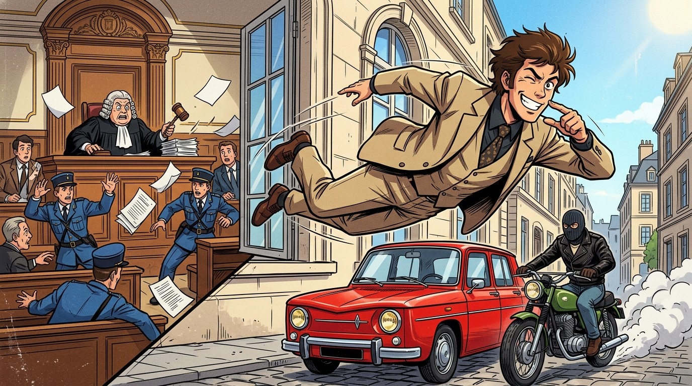

# 🖼️ 法庭飛躍·世紀越獄 (The Courtroom Leap: Casse du Siècle)

這絕對是世界刑偵與審判史上最囂張的一幕——當法律體系試圖用謊言套路狂徒時，狂徒就用法庭跳窗來回敬整個體系！

畫面定格在 1977 年 3 月 10 日的尼斯法庭：身穿復古西裝的斯帕加里趁著法官糾結看工程草圖看不懂，假借「上前向法官解釋圖紙」誘使法警放鬆戒備，隨後突然助跑、縱身破窗躍入半空中！他在騰空之際回頭衝著驚慌失措的法官與法警露出得意的眨眼與手勢，滿天卷宗紛飛；樓下陽光灑落的街道上，一輛紅色雷諾轎車車頂充當完美緩衝墊，接應的復古摩托車已拉響油門、噴吐白煙等待接駁！

從金庫打洞到法庭跳窗，再到離法院不到 1 公里的地下停車場後備箱完成「燈下黑」——這就是狂妄到極致的浪漫派狠人！

