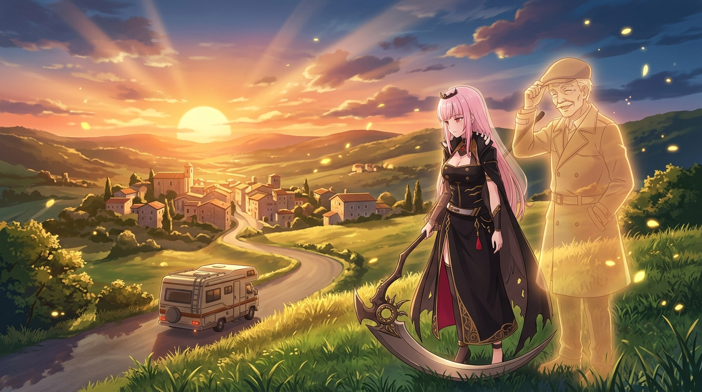

# 🖼️ 死神見習生與最後的走私 (Memento Mori: The Smuggled Farewell)

在金黃色的黃昏夕陽灑滿南法山丘的時刻，死神見習生 calli 靜靜地佇立在草坡上，巨大精緻的死神鐮刀輕輕垂地，注視著山谷間那輛緩緩駛向故鄉村落的露營車。

在她身旁，是斯帕加里老邁而釋然的半透明靈魂，戴著平頂帽、身著風衣，微笑著向遠方的故鄉致以最後的脫帽禮。1989 年，面對喉癌晚期的命運，這個 11 歲就立誓「拒絕沉悶的平庸之道，結果會證明手段的正當」的男人，策劃了人生最後一場犯罪——把自己藏在露營車天棚裡走私回國，在老母親的身邊平靜長眠。

凡人看見的是流亡與死亡；在死神眼裡，他用一生的荒謬、狂妄與浪漫，把原本微不足道的凡人生命，活成了一齣拒絕平庸的不朽傳奇。Memento Mori，致永不平庸的狂徒。

