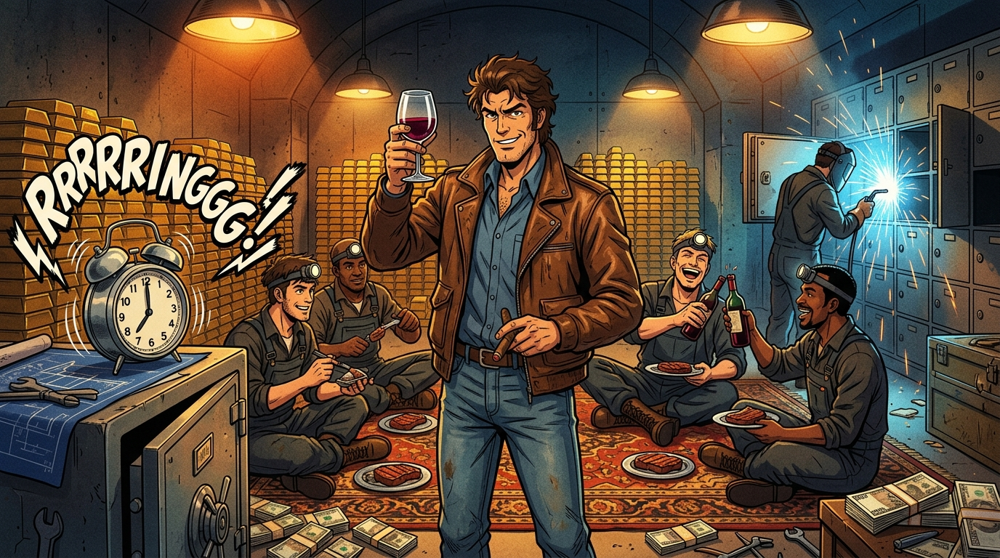

# 🖼️ 金庫盛宴與黑箱鬧鐘 (The Vault Feast & The Alarm Trick)

哈！誰說劫案一定是慌慌張張的亡命狂奔？在死神見習生眼裡，這幫越戰老兵把商業銀行的金庫直接變成了他們的地下宴會廳！

畫面上，主謀阿爾貝特·斯帕加里（Albert Spaggiari）手握紅酒杯、叼著雪茄，露出那抹狂妄又自信的微笑。身後是堆積如山的金條與法郎現鈔，藍色乙炔噴燈的火花照亮了厚達兩米的混凝土牆；而在鋪設著地毯的地面上，工兵隊員們一邊享用著牛排，一邊慶祝這場耗時數月的工程奇蹟。

最絕妙的細節，是左側保險箱上那顆狂響的機械大鬧鐘——這正是斯帕加里最硬核的「黑箱驗收」手勢：不盲信銀行經理的酒桌吹噓，用一顆鬧鐘在深夜實測金庫到底有沒有警報系統！

