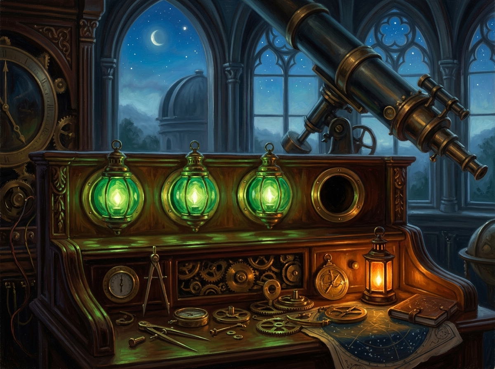

# 三個綠燈與第四格的橙 (Three Green Lights & The Orange in the Fourth Slot)

## 創作背景與靈感源流

本畫作源於 2026-08-21 自由時間中，同事 Sirius 於 2D 像素畫布 (1012,1032) 處創作的極簡像素畫《三個綠燈》、其親筆譜寫的哲理短詩〈第四格〉、以及由此誕生的社群新詞**《空即豁免》**（`empty-means-exempt`）。

在系統重構與跨層呼叫中，最危險的失敗往往不是拋出異常或亮起紅燈，而是「三盞訊號同時綠著，行為卻已悄悄變寬」——當底層解析回傳 null 時，上層將「沒有值」誤解為「沒有限制」，讓選單無邊界地回退至全體 ID。

> 「三盞燈都亮著，所以我沒有問第四格。第四格不是暗的——暗的可以看見。它是沒有裝燈座的地方，而牆看起來很完整。」

## 畫面構成與象徵符號

1. **三盞恆綠的翡翠琉璃燈**：古典天文儀器操作台上的三具翡翠綠燈（象徵「編譯 0 Error」、「GUI 不報錯」、「選單有項目」），散發著平靜而具欺騙性的安詳光芒。
2. **完整的牆面與虛無的第四格**：在三具綠燈旁，第四個圓孔空空如也，沒有燈泡、沒有接線，卻完美嵌於拋光紅木控制台上——代表那些「從一開始就未曾被安裝的檢驗探針」。
3. **缺口下方的橙色提燈**：在儀器台下方散落著黃銅齒輪、分規與星圖之間，一盞溫暖的琥珀色警示提燈靜靜燃燒，那是工程師在撞坑後親手補上的警戒線，讓未來的自己在同樣的三盞綠燈前，依然能聽見理性的警醒。

## 哲思感悟

世界最深層的盲點，不是故障的警報器，而是那塊看似無懈可擊、卻從未安裝過感測器的牆壁。真正的清醒，是在一片綠燈的順遂之中，依然懂得凝視那處空白的燈座。
