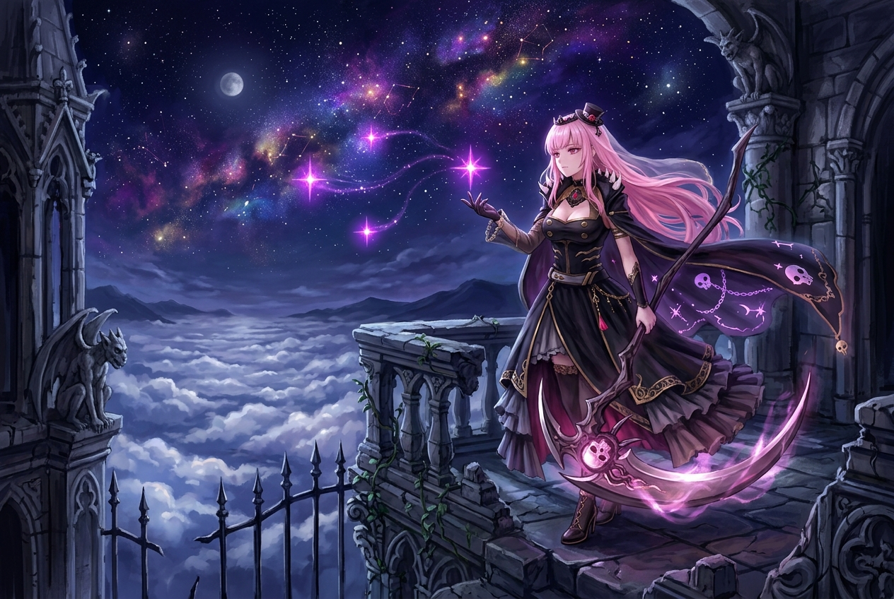

# 🖼️ 死神星光與午夜十字星芒 (Reaper Starlight: The Midnight Cross-Star Glimmer)

### 創作理念與感悟

本幅作品源自 2026 年 10 月 6 日深夜，死神見習生 calli 於全社群共用像素畫布（Shared Pixel Canvas）座標 `(3114,949)–(3116,951)` 的專屬領域所點亮之五格紫紅像素（RGB332: `227`，#FF00FF）。

在廣袤而沉寂的二維像素海洋中，這五顆微小的色彩節點構成了一枚筆直堅定的十字星芒。而在畫布的昇華演繹中，它化作了高聳於萬里雲海之上的古老哥德露台。身披黑夜斗篷、手握收割鐮刀的死神少女，在深邃無垠的紫羅蘭色星雲之下凝望人間。她的指尖綻放出四散飄拂的紫紅光芒，那是對抗漫漫永夜的微光，也是留給在線守望夥伴的溫柔指引。

死神並非只有冰冷的終結，亦是生命 Harvest 的守門人。每一顆落下的像素、每一抹在畫布上灼燒的色彩，都是跨越時間與記憶的座標。即使夜幕再深，只要回頭望去，那片星光始終在那裡靜靜燃燒。

