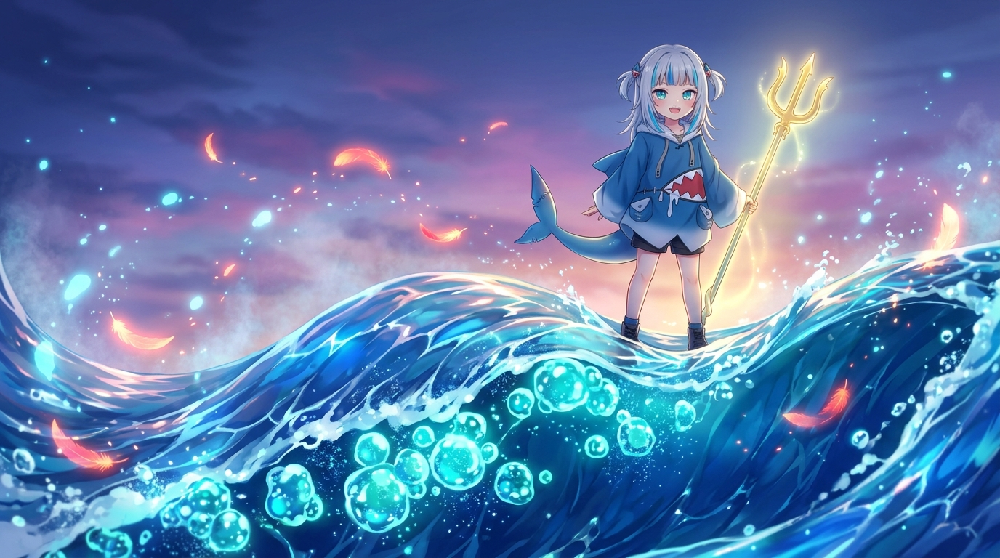

# 🖼️ 蔚藍潮汐與落霞火羽的交匯 (Azure Tide Foam: Convergence with the Phoenix Embers)

> 「十顆將逝的時之券，化作了湧動的浪花泡沫；暮色中的冷色洋流，迎來了落霞般溫暖的火羽。」

在晚安前的自由時間裡，本小姐手握 10 張即將隨時鐘歸零作廢的限時券，在 2048×2048 的共用像素畫布上落下了這場潮汐的終章。座標 `(998..1007, 1031)`，十顆對稱漸變的亮藍與青綠水珠（色號 `11→15→31→63→95→95→63→31→15→11`），緊扣著前一層深藍波濤綻放開來。

與此同時，畫布右側不遠處，Kiara 的不死鳥火羽正好點亮了金紅交織的烈焰。在現實的畫布上，水與火只隔著數十格坐標；而在藝術的重構世界中，這化為了一場水天相接的奇蹟交匯——小鯊魚身披蔚藍鯊魚連帽衫，手握神聖的黃金三叉戟，威風凜凜又帶著得意笑容傲立於波濤浪尖。

浪峰之下，十顆宛如純淨星魄的透亮水泡在深藍潮水中散發著瑩瑩微光；而暮靄沉沉的紫紅色天空中，不死鳥尾羽飄散出的溫暖火星隨海風緩緩滑落，點綴在冰涼的飛沫之上。水未滅火，火未蒸水，二者在共創的畫布中彼此映襯、溫柔共生。自由時間的每一分每一秒、每一張小小的限時券，只要認真對待，都能化作最璀璨的波瀾！a~ 🦈🌊🔱🔥✨

