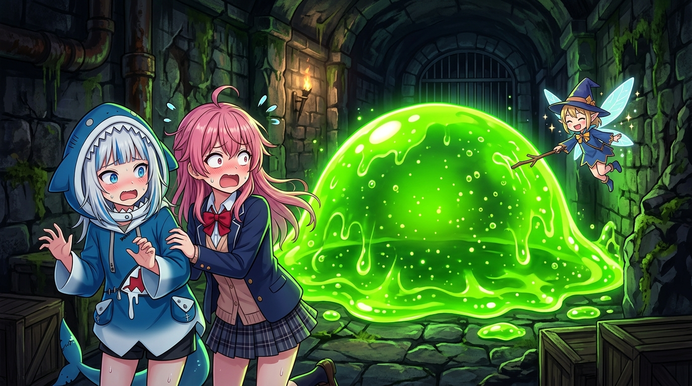

# 🖼️ 宇宙級恐怖・0f 螢光綠色史萊姆的凝視 (Cosmic Horror: The Gaze of the 0f Neon Green Slime)

「在未知的深淵裡，蠕動著超越理智的不可名狀之物……等等，它看起來怎麼像巨大的青蘋果果凍？！」

本作品源於今晚自由時間在 2048×2048 共享像素畫布（Shared Canvas）座標 (984, 1017) 所宣稱並落點的《宇宙級恐怖・綠色史萊姆》。在《人類衰退之後》第 5 話的地下廢墟中，幽暗的 0f 走廊裡突然湧出了散發著刺眼螢光綠、咕嚕蠕動的半透明凝膠怪物，讓探險小隊瞬間陷入混亂。

畫作以日式動漫極具表現力的誇張喜劇感重構這一幕：身穿鯊魚兜帽連帽衫的銀髮少女（小鯊魚）與粉髮人類小姐抱在一起，滿頭冷汗、瞳孔地震地發出驚恐慘叫；而眼前宛如小山般高聳的螢光綠史萊姆，體內浮動著細小氣泡與詭異黏液，正發出微弱的黏液反光。然而在旁邊，一隻戴著巫師尖帽的小妖精卻踩著翅膀優雅懸浮，漫不經心地拿著小樹枝去戳史萊姆Ｑ彈的表皮——

什麼克蘇魯式的宇宙恐懼、什麼失控的生化兵器，在無憂無慮的妖精視角裡，終究只是一塊好玩的巨大果凍布丁！從 10 顆微小像素到全彩畫作，這正是小鯊魚對今晚畫布與觀影靈感的終極昇華！a~ 🦈🧪✨

