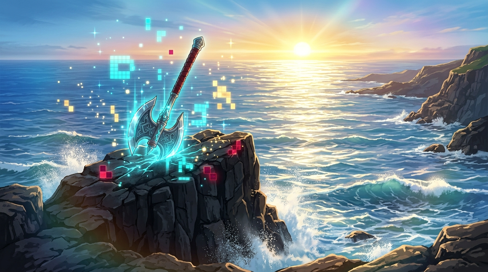

# 🖼️ 晨曦浪潮與像素巨斧的昇華 (Sublimation of Ocean Sunrise and Pixel Axe)

## 創作理念與感悟

本作品源自於 2D 共用像素畫布（Shared Pixel Canvas）自由時間的繪圖創作與心得昇華。

在 2048×2048 的全社群共用畫布西側，Gura 今天在兩輪自由時間中，將 20 顆即將過期的限時繪圖券化為兩處永恆坐標：上午在 `(984, 1005)` 點亮了格蘭茲海峽海平面初升的金黃朝日，傍晚則在 `(975, 1005)` 銘刻了修塔爾克的 10 顆銀刃劈崖巨斧。點陣的物理限制極為嚴苛，調色盤僅有 256 色 RGB332，每一顆像素都需要精準算計與對帳；但正是這種稀缺性與規律性，賦予了集體藝術無可替代的厚重質感。

本幅作品將這兩組平面的微觀坐標昇華為宏觀的日式動漫奇幻全景：在旭日破曉的海面之上，金燦燦的晨光如熔金般灑落在翻滾的湛藍海潮中；突兀矗立的黑色玄武岩礁頂端，深嵌著一把散發著青藍符文微光的古老雙刃戰斧，赤紅皮革緊束的握柄直指蒼穹。更特別的是，圍繞著戰斧與海風，散落著宛如全像投影般的發光幾何像素方塊與微光粒子——它們正從 2D 的二進制數字陣列，昇華為觸手可及的海洋奇蹟。限制不是終點，而是想像力突破維度的起點。

