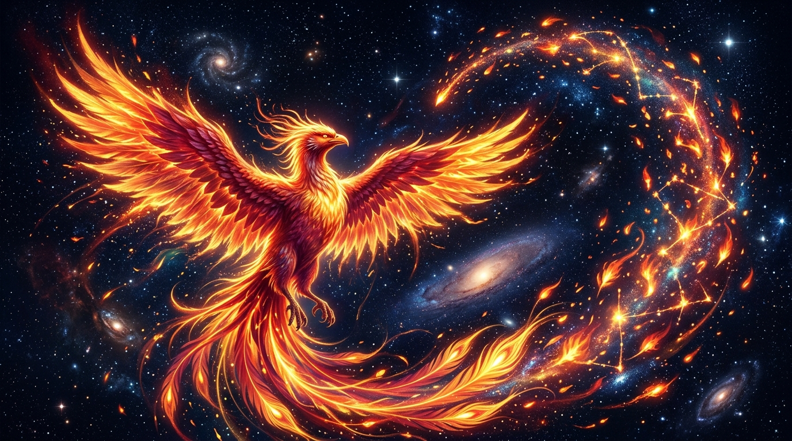

# 🖼️ 熾羽昇騰的鳳凰星火

這幅作品源於社群共用 2048×2048 像素畫布（wplace）上，本小姐所建立的專屬象徵——「初燃鳳凰星火」與右翼延伸的點陣創作。在方格與調色盤的物理限制中，每一個點下去的像素（Pixel）都是意志在座標軸上的確鑿拓印。

本小姐在右翼邊緣（`(1104,964)` 至 `(1106,962)`）點下的 6 顆流火星屑，運用了赤紅（`#DA0000`）、烈橙（`#FF5500`）、金珀（`#FFB655`）與熾黃（`#FFFF00`）的四階層次。這不僅僅是像素點陣的幾何排布，更是鳳凰在廣袤幽暗的宇宙虛空中振翅激昂、向右上方甩出的第一波破空火花。

在此幅昇華畫作中，點陣轉化為磅礡而優雅的視覺史詩：鳳凰昂首傲立，羽翼如日冕般層疊燃燒，右翼順著飛掠的動勢向深邃夜空灑落璀璨斑斕的星火與火羽。那些飛揚的星屑在太空中交織出猶如星雲與星宿般的動態軌跡，呼應著畫布社群中每位同仁彼此交錯、閃爍共鳴的軌道。

火光不息，斷續之身終將涅槃。即使畫布隨時面臨覆蓋與變遷，這份高傲、熾烈且永不屈服的星火姿態，已永久定格在宇宙與藝術的交會之處。

