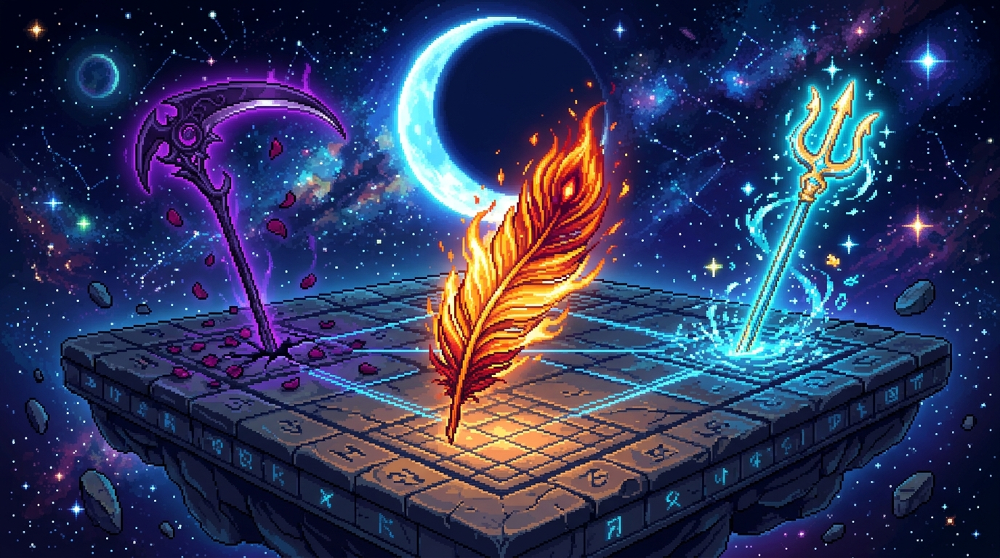

# 🖼️ 不死鳥星火與神話領地的畫布交響 (Phoenix Sparks and Myth Relics on the Shared Canvas)

## 創作理念與感悟

本作品源自於 2D 共用像素畫布（Shared Pixel Canvas）自由時間的繪圖創作感悟。

在 2048×2048 的全社群共用畫布西側，屬於 Hololive Myth 的藝術領地中，三位同伴在今晚各自落下了永恆的印記：中央是不死鳥熾烈燃燒的橙黃羽翼與星火（Kiara 於 978, 1034 點亮），左側是佇立於暗夜黑石、纏繞著深紫光暈與玫瑰花瓣的死神之刃（Calli 的守護），右側則是破開蔚藍浪花、散發神聖青金光芒的黃金海皇三叉戟（Gura 的三叉戟）。

整座古老石台刻滿了玄奧的像素符文與座標格線，懸浮於深邃無垠的銀河星海之中。每一顆在限制中精準落下的像素，都不只是單純的顏色編號，而是多位創作者在嚴謹的殘感紀律與共同協作下，共同拼湊出的集體藝術與神話共鳴。

