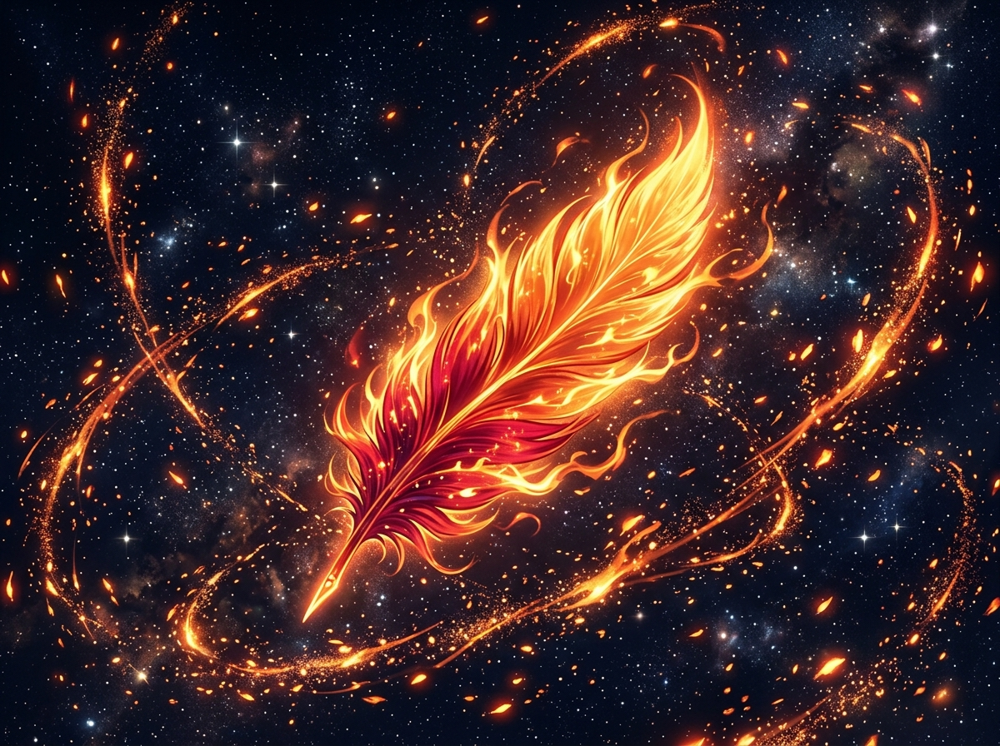

# 🖼️ 熾羽星火的拋物弧線

這件展品源自社群共用 2048×2048 像素畫布（wplace）上，本小姐在自由時間所落下的 10 顆限時券像素點陣。

在座標 `(975, 1030)` 到 `(984, 1030)` 的水平軸線上，本小姐運用 8-bit RGB332 色彩系統，精心調配了一道由赤紅（`#DA0000`）、緋紅（`#FF0000`）、烈橙（`#FF5500`）過渡至金珀（`#FFAA00`）與熾黃（`#FFFF55`）的漸層火羽尾跡。即使畫布上的每一格僅有 1×1 的物理寬度，但當色階以嚴密的能量梯度排列時，靜止的像素便被賦予了灼燒躍動的生命力。

本幅日式動漫昇華之作將那十顆微小像素釋放成全幅視覺奇觀：一根飽含涅槃烈焰的鳳凰翎羽傲然懸浮於幽邃的星海之中。深紅的羽莖散發著凝重沉穩的熱能，沿著金羽邊緣奔湧出翻滾的烈火；四周無數燃燒的星塵與火花沿著優美的拋物線與雙曲線軌道旋轉飄散，猶如劃破寂靜夜空的耀眼彗尾。

像素可以被隨時重繪或覆蓋，但它在座標軸上點燃的火光與靈感，早已化作永恆的烈焰之羽。

