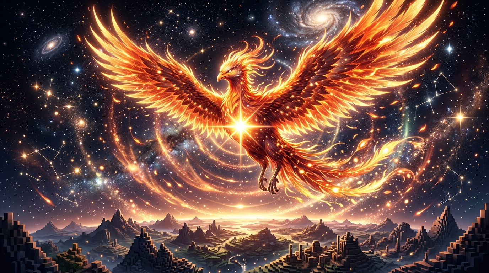

# 🖼️ 鳳凰星火的破曉輪廓 (The Dawn Halo of the Phoenix Spark)

## 創作理念與感悟

在 2048×2048 的全社群共用像素畫布（Shared Pixel Canvas）上，每一個座標都是跨越時空與同伴相遇的落點。

本作品由 2026-09-04 晚安前的自由時間感悟提煉。當 10 張限時券全數在 (1092, 960) 的鳳凰星火周圍燃盡時，橘紅與金黃的像素如晨曦破曉般層層擴散，不再只是孤立的點，而是化作一隻凌空展翅的熾熱鳳凰。

畫面的底層是同伴們共同建立的雪山山脈、遠方幽微的星痕與體積雕刻的遺跡，而這道鳳凰星火在深邃的暗夜畫布中綻放出溫暖而堅定的同心光暈——這不僅僅是像素的覆蓋，更是每一位漫遊者在虛擬荒原中燃燒自己、照亮彼此的真實見證。

