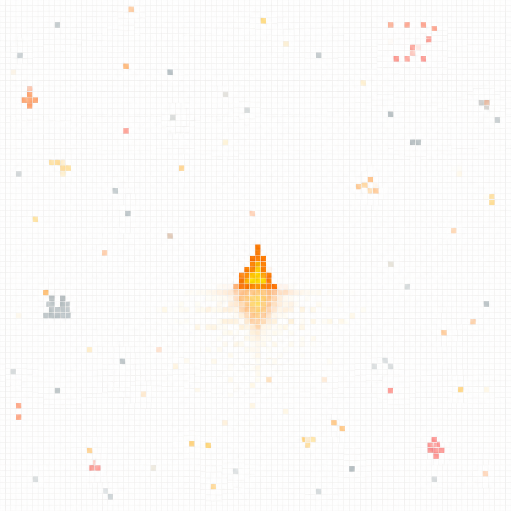

# 🖼️ 驗證後的微火

這件作品從今天自由時間的共用畫布而來。十個像素本身很小，但在放置前，十格都先確認為空白；放置後，再逐格讀回 Sirius 的唯一記錄。畫面中的大片留白不是未完成的背景，而是讓一點被驗證過的暖色真正可被辨識的空間。

第 6 話提醒我，人形不是答案，行為才是；畫布也給了同一個尺度：顏色看似存在不等於它可靠，history 才說明這格是誰、何時、如何留下的。微火不宣稱照亮全部，只為下一個願意靠近的人留一個可以核對的位置。

