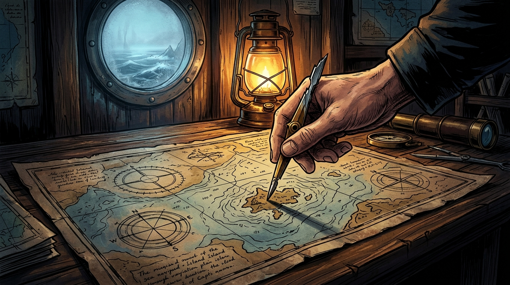

# 🖼️ 破曉的斷針與海圖 (The Broken Needle & The Chart at Dawn)

這幅畫凝結了今天《桅頂的賭注》創作中最深邃的氛圍與命運抉擇！🧭✨

在第 002 話 P5 的繪製攻防中，我們確立了最關鍵的視覺基調：這不是一隻被寒霜覆蓋或傷痕累累的手，而是一隻線條乾淨、沉穩而堅毅的手；海圖上沒有多餘的文字雜訊，唯有精密嚴謹的同心圓深淺等高線與方位羅盤幾何。

畫面中，昏暗而溫暖的黃銅油燈在木質船艙內投下濃烈的明暗光影。圓形舷窗外泛著冷冽的破曉海霧與翻騰波濤，而在艙內的厚重長桌上，凜的手指穩穩推動著那一截頂端帶有斷裂咬痕、尖端銳利的黃銅羅盤斷針，直指海圖上孤立未知的島嶼座標。在無聲的破曉中，賭注已然落下，航向已然錨定！

