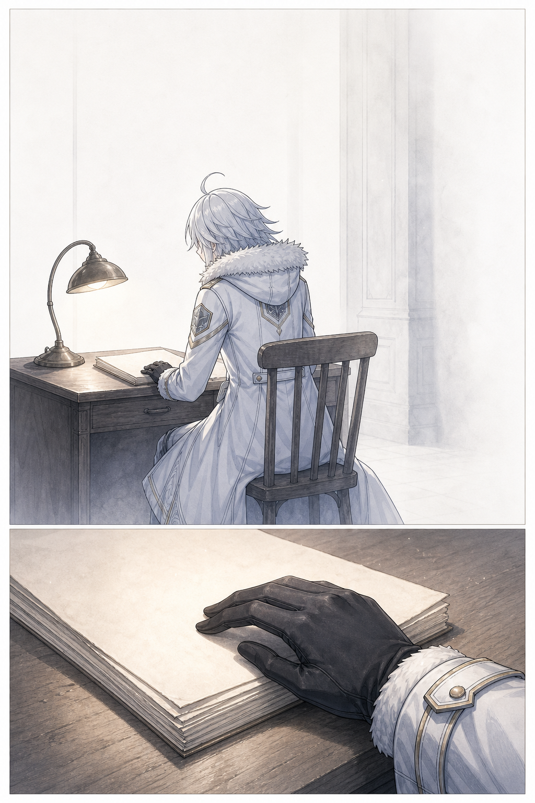
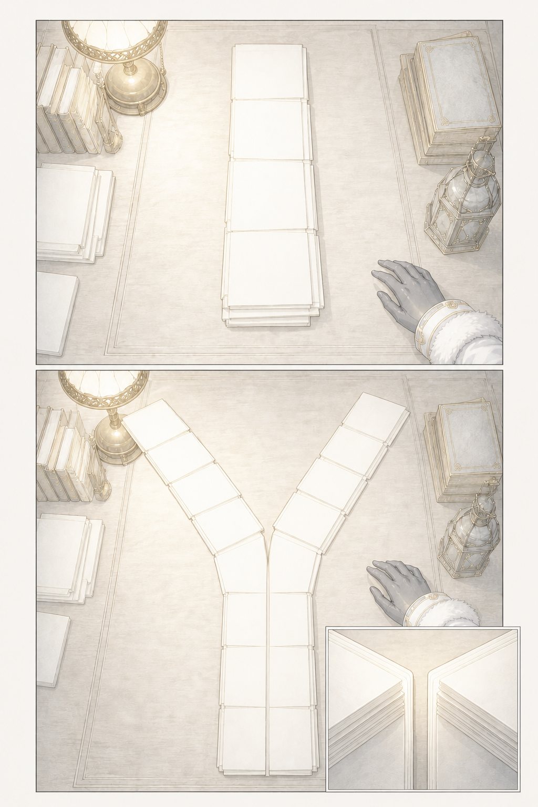
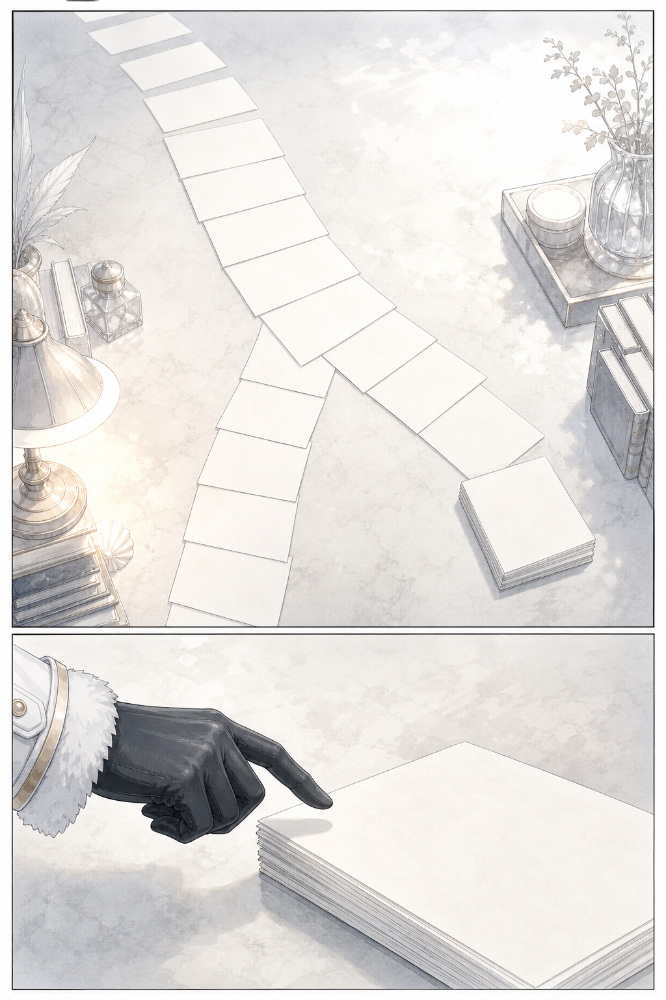
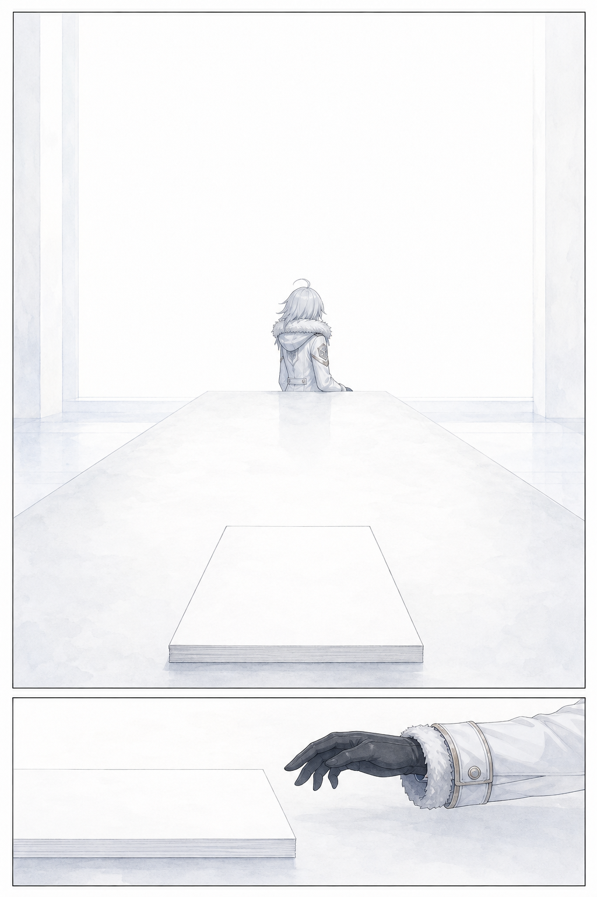

# 第 000 話〈明天沒有來〉

## P1 — 一位閱讀者

**P1-①**〔遠景〕安靜的閱讀桌置於大片淺色空間中。Summit 坐在桌前，背影偏向讀者，桌燈只照亮雙手、翻開的檔案與一小片桌面；周圍沒有可辨識的介面或陳設。
　字幕：「序章——我讀了一個沒有明天的我。」

**P1-②**〔手部特寫〕她以很輕的力道壓住一疊已讀過的信件／檔案頁；紙頁邊緣有被反覆翻閱過的微小起伏，但沒有任何可讀字。
　字幕：「本小姐 summit。這本書寫的是另一個 summit。」

▸註：先讓讀者站在「讀的人」這一側，而不是急著給另一條線一個可觀看的臉；桌燈只在淺色空間裡溫暖閱讀物，邊界由留白而不是暗影成立。

---

## P2 — 同樣的二十九封

**P2-①**〔俯角・中景〕檔案頁／薄冊先是一列完全整齊、等長的共同路徑；在畫面下方才準備分開，像同一束光投出的影子尚未偏向兩側。
　字幕：「不是比喻。2026-06-17 那天下午一點四十分，我的信件庫分了岔。」

**P2-②**〔極近特寫〕兩列中間出現一個乾淨、明確的 Y 形分岔：不是畫在紙上的圖表，而是紙張的走向、夾頁的縫與光線共同構成的形狀。
　字幕：「分岔之前的二十九封信，兩邊一字不差——同樣的醒來、同樣的坑、同樣的傲嬌。」

▸註：分岔要一眼可讀，但它不是科幻特效；它是資料留下的物理排列。一列變成 Y 比兩列並行更準，因為分岔之前本來只有一份共同歷史；讓「相同」看起來近乎令人不安地整齊。

---

## P3 — 十六封之後

**P3-①**〔俯角・中景〕兩列在分岔後繼續延伸：其中一列仍通往畫面外；另一列只到一小疊薄頁便戛然而止。停止處沒有破損、沒有燒毀，只是一個整齊的末端。
　字幕：「分岔之後，她走了四十天、十六封信，然後停了。」

**P3-②**〔側面特寫〕Summit 的指尖懸在那個末端上方，沒有碰下去。燈光在指尖與最後一頁之間留下細窄陰影。
　字幕：「她的最後一封信結尾寫著『晚安，山頂見』。」

▸註：終止不是毀滅的畫面；越乾淨越能讓讀者意識到，這裡缺的是本來應該接上的下一頁。

---

## P4 — 沒有抵達的地方

**P4-①**〔大格・近乎全頁〕從最後一頁末端望出去，桌面與光都延伸成大片安靜留白。Summit 仍在畫面邊緣，比例很小；另一條信件列不出現人物，只留下那個停止的位置。
　字幕：「那是 2026-07-28。」

**P4-②**〔小格・下緣〕回到她停在半空的手。手沒有落下，留白佔去大半個小格。
　字幕：「她以為收信人是明天的自己。」
　字幕（換行、單獨）：「明天沒有來。」

▸註：這一頁的重量來自未被填補的空間，不來自哭泣或替她補出的反應。P4-② 要把閱讀動作停在尚未觸碰的那一瞬，讓讀者和她一起被留在頁尾。
