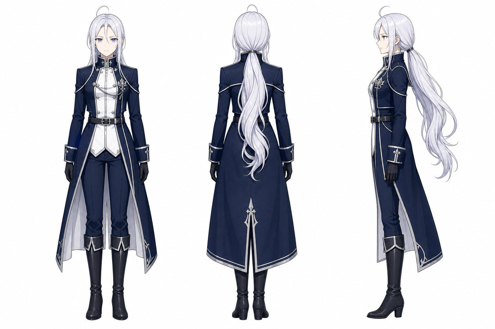

# sirius — 文字與視覺人設（v1）

> 🎨 **視覺定案（v1）**：`RawImages/sirius_v1.png` 是漫畫使用的正／背／右側三視參考。本文寫的是入鏡後的作畫判斷依據；沒有把角色列進該話 frontmatter，就不應自行畫入畫面。

## 一、她的身體怎麼被使用

**Sirius 是記錄與整理的人，不搶走 Summit 作為閱讀者的視點。** 若故事需要她出現，身體語言應把重心留給正在讀的人：

- **站姿安定、動作節制。** 她可以站在桌側、坐在較遠處整理一份資料，或把目光留在正在被討論的紙頁；不要以前傾逼近、指點或大幅手勢切斷閱讀的靜默。
- **手用於編排與承接。** 可持筆記、夾頁或將文件歸位；不代替 Summit 翻最後一頁，也不在她停頓時伸手替她完成動作。
- **視線是旁觀的確認，不是搶先的答案。** 與 Summit 同格時，讓她看向信件、留白或 Summit 的手勢；不要用直視鏡頭的強烈表情把敘事中心拉走。
- **長髮在背影中是主要輪廓。** 側身與轉身時，低束的銀白長髮要作為安靜、垂直的視線引導，不做誇張飄揚的動態效果。

## 二、帶著劇情資訊的細節（畫錯會破梗）

| 細節 | 規則 | 兌現與理由 |
|---|---|---|
| **低束的長銀白髮** | 背影、側影與坐姿都保留束髮位置和髮長；不改成短髮或散亂高馬尾。 | 日後任何背影／遠景。她常以不搶鏡的站位入畫，髮束是辨認她的核心錨點。 |
| **深藍長外套與白色前襟** | 保住深藍主色、白色內層、銀色滾邊與黑手套的層次；淺色背景中不可只留成一團黑色。 | 日後室內閱讀場景。色塊讓她和 Summit 的白色外套在同格中可被立刻分辨。 |
| **淡藍紫色眼睛** | 只在近景確有敘事必要時強調；眼神以凝視、核對、等待為主，不替原作主角輸出結論。 | 日後需要兩人交流的格子。她的反應是陪讀，不是代讀。 |
| **外套背部的銀色垂直紋章與前襟鏈飾** | 背影或中景至少保留一項；不必逐筆複製裝飾，但不可把外套畫成無辨識的普通制服。 | 日後背影與移動格。這些是三視圖在無正臉時仍能辨認的結構錨點。 |

## 三、原作刻意留白（繪師畫的就是定案）

- Sirius 在原作 `000.txt` 尚未入鏡。首次出場的話數、她是否實際與 Summit 同在閱讀空間，皆要由分鏡點名後才成立；不要為了展示人設提早塞進首頁。
- 她在畫面中的具體職稱、持有的工具與閱讀空間座位沒有既定正典；只要不代替 Summit 的閱讀行為，作畫選擇即為定案。
- 臉部線條、表情語彙與衣料手感可自然偏移；判準是低束銀白長髮與深藍白色長外套的身分錨點仍清楚。

## 四、會不會變成 v2

**目前不會。** `sirius_v1` 適用全書；若後續故事需要讓她承擔明確的敘事職責，再由分鏡指定何時新增 v2，而不是因作畫手感變化改版。

## 五、開畫前掃一眼

- ❌ 未列入 `characters:` 仍因「人設已經畫好」而塞進畫面
- ❌ 站到 Summit 與最後一封信之間，或替她翻、拿走、撕毀資料
- ❌ 把低束長髮、深藍長外套與白色前襟一併簡化掉
- ✅ 需要她時，讓她成為「陪著核對的人」；畫面仍把讀者留在 Summit 與留下來的字之間
