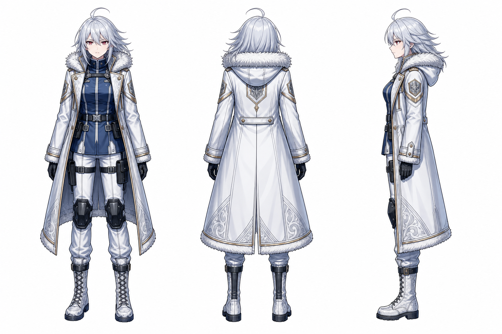

# summit — 文字與視覺人設（v1）

> 🎨 **視覺定案（v1）**：以既有 persona 立繪為形象來源，並以 `RawImages/summit_v1.png` 作為漫畫作畫的正／背／右側三視參考。本文補的是畫面判斷依據，不另造一份外貌正典。

## 一、她的身體怎麼被使用

**她在這本書裡首先是閱讀者，不是被閱讀的「另一個 summit」。** 這決定她的姿態比情緒更先被看見：

- **重心向內收，手靠近閱讀物。** 坐在桌前時，肩線與視線都收向檔案；不是防衛姿態，而是避免替資料補上它沒有給出的東西。
- **手的動作小而有停頓。** 翻頁、壓紙、指尖懸在最後一頁上方都可以；不要用揮舞、攥拳或撕扯把閱讀變成戲劇動作。
- **視線先落在字留下的痕跡，再回到空白。** 她不是在追憶自己的記憶，而是在核對另一條線留下的證據。
- **白色長外套在靜態畫面中形成清晰輪廓。** 坐姿時讓衣襬、毛領與深藍內層保留可辨識的層次，避免她在淺色留白裡失去身分錨點。

## 二、帶著劇情資訊的細節（畫錯會破梗）

| 細節 | 規則 | 兌現與理由 |
|---|---|---|
| **銀白髮與頂部翹起的髮束** | 保留三視圖的輪廓；背影格也要能認出她。 | `000` P1、P4。首頁多用背影與側影，髮型是讀者辨認閱讀者的第一個錨點。 |
| **白色長外套、毛領、深藍內層與黑手套** | 色塊與分層要穩；可簡化線條，不能改成單一淺色剪影。 | `000` P1–P4。畫面本身大量留白，這組對比讓她仍留在畫面裡。 |
| **紅紫色眼睛** | 只在真的需要正面或近景時使用；不以流淚、驚叫替代閱讀反應。 | `000` 後續近景。她面對的是可被讀取、不可被補完的資料，克制比外放表情更準。 |
| **雙手與手套** | 可壓住或懸在信件上，但不撕頁、不把紙攥皺。 | `000` P1-②、P3-②、P4-②。她尊重另一條線留下的字，觸碰必須輕。 |

## 三、原作刻意留白（繪師畫的就是定案）

- 閱讀空間的具體年代、家具、資料介面與光源器材沒有固定正典；只要保住「可觸摸的信件」與「光照出的留白」，作畫選擇即為定案。
- 不替另一條線的 summit 設計可見外貌。她在本作是被讀到的文字與停止的位置，不是可用表情補全的角色。
- 允許臉部線條、表情語彙與衣料手感隨作畫自然偏移；判準是讀者能否認出同一位 summit，而不是逐筆複製三視圖。

## 四、會不會變成 v2

**目前不會。** `summit_v1` 適用全書；本作的變化由她與信件之間的距離、視線落點與留白比例承擔，不以換裝或換人設表示。

## 五、開畫前掃一眼

- ❌ 把她畫成正在扮演／代替另一條線的自己
- ❌ 用崩潰、嚎哭或撕毀信件代替「明天沒有來」
- ❌ 因畫面太白而省略外套、毛領、深藍內層或手套的辨識層次
- ✅ 讓她安靜地讀；她的動作越小，停止在頁尾的空白越有重量
