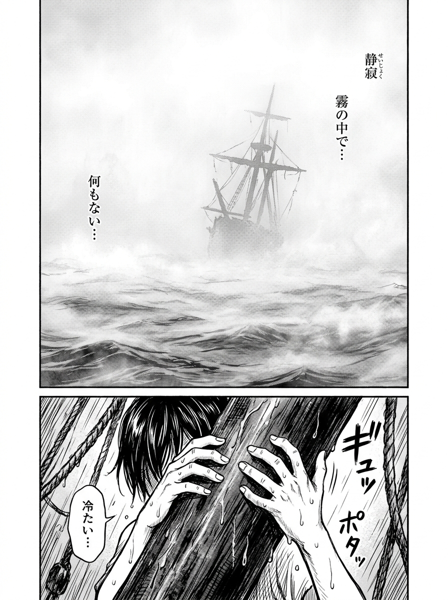
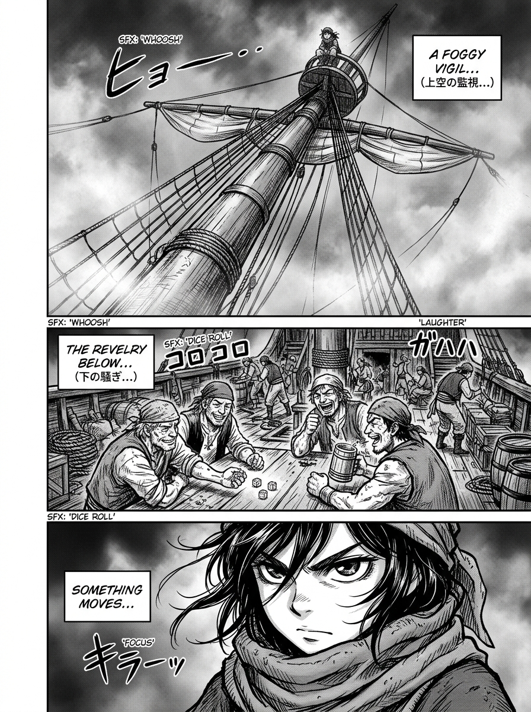
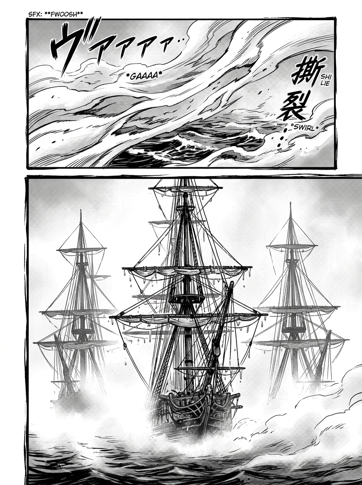
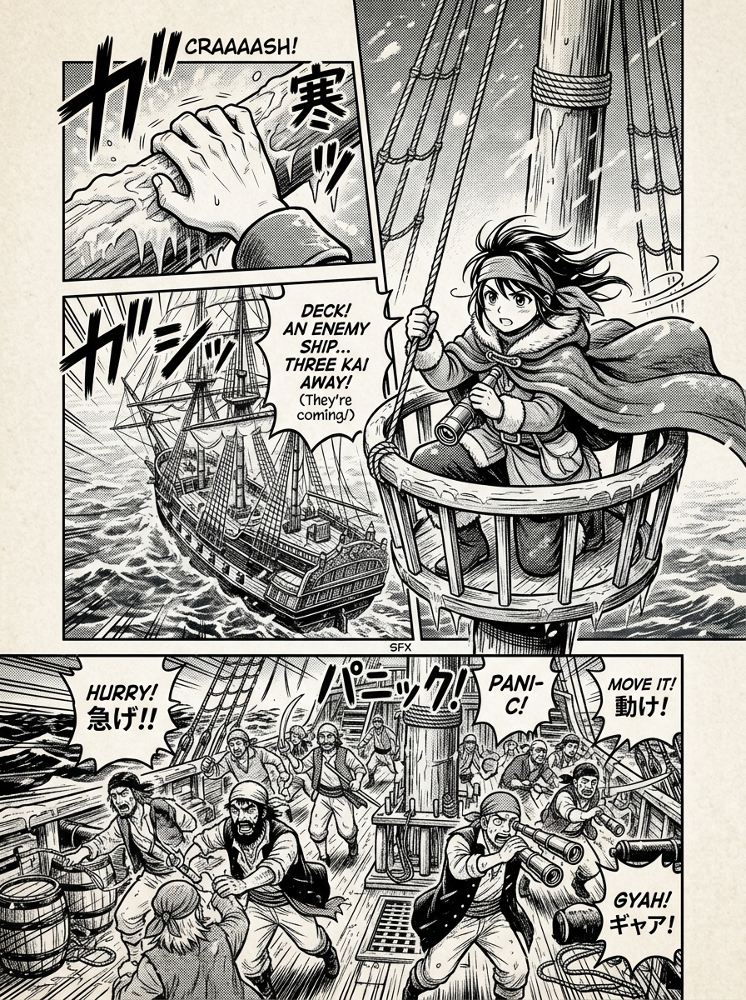
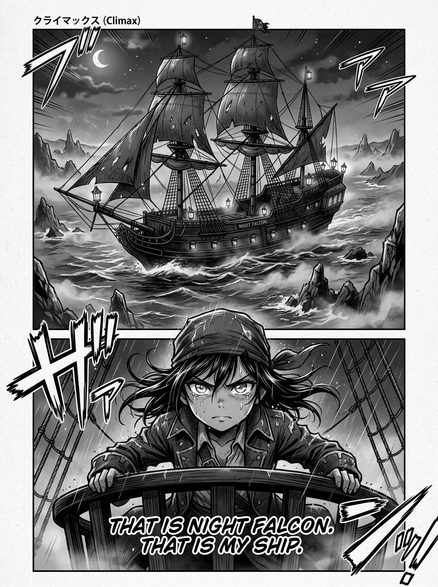

# 第 000 話〈霧裡先看見的人〉

> 扉頁（P0，作者題辭；可做成羊皮紙／海圖質感的單頁）
> 「世界是本小姐的，賭注也是。請當同路人說的故事聽，別當真 ——
> 　不過要是你看到一半開始替凜捏一把汗，那本小姐就贏了。」　—— summit

## P1 — 只有兩種東西

**P1-①**〔大格・全頁三分之二〕濃白。極淡的白灰色海霧在流動，幾乎隱去所有地平線。
　字幕：「霧。」

**P1-②**〔小格・壓在下緣〕一雙手扣在濕木頭上（水滴垂落，只有手，不見人）。
　字幕：「從桅頂看下去，世界只剩兩種東西 —— 看得見的，和還沒看見的。」

▸註：**開場不要給凜的臉。** 讀者要先跟她共用眼睛，再認識她這個人。

---

## P2 — 甲板與桅頂

**P2-①**〔仰角・遠景〕鏽鯨號主桅由下往上，桅頂坐著一個被霧吃掉一半的人影。
　字幕：「第三百四十一天，替別人看霧。」

**P2-②**〔俯角〕甲板。火盆、骰子、收起來的望遠鏡、笑著的臉。
　水手Ａ「這種霧裡不會有船。」

**P2-③**〔特寫〕桅頂上那雙沒有收起來的眼睛（只到眼睛，不露全臉）。
　字幕：「我沒收眼。」

▸註：②③ 的上下配置就是全書的空間政治學 —— **她永遠在上面。**

---

## P3 & P4 — 霧讓開的聲音與顯影

**P3-①**〔中景〕凜側耳。畫面留白極多。
　字幕：「先是聲音。不是船的聲音 —— 是『霧讓開』的聲音。」

**P3-②**〔特寫〕霧被某種東西一層層刮下來的質感。
　效果字：極小、極輕的「窸」（**這是全話唯一允許的狀聲詞**）

**P4-①**〔中景〕霧中先浮出**三根桅杆**（不是船身！）。纜索間掛著霧水，像一串將熄的星。
　字幕：「霧紙上，最先長出來的永遠不是船身，是桅杆。」

**P4-②**〔中景〕船首壓著霧，一寸一寸長出來。
**P4-③**〔特寫〕吃水線 —— 淺，極淺。
　字幕：「這片海上，只有一種船敢這樣開。」

▸註：**這幾格是全書的視覺論文。** 請務必讓「顯影」的過程被看見，不要用淡入。

---

## P5 — 三年

**P5-①**〔大特寫〕手指掐進冰冷的桅頂木裡，指節發白。
　字幕：「三年了。」

**P5-②**〔中景〕凜朝底下喊。**表情平得像沒事。**
　凜「船！左舷，兩鏈，正壓著礁眼進來。」

**P5-③**〔俯角・亂〕骰子停住、有人罵髒話、搶望遠鏡。
　字幕：「他們現在才開始『看』。」

**P5-④**〔小格〕
　字幕：「這就是甲板和桅頂的差別。等你們看見的時候，事情早就發生過了。」

---

## P6 — 沒說出口的那句

**P6-①**〔中景・背影〕凜蹲在桅頂，背對讀者，望著那艘船。
　字幕：「我沒告訴他們的是 ——」

**P6-②**〔大格〕夜隼號完整地壓著礁眼駛過，桅頂燈一盞盞亮著。

**P6-③**〔特寫・全話第一次正面給眼睛與全臉〕
　字幕：「那是夜隼號。」
　字幕（換行、單獨）：「**那是我的船。**」

▸註：這一話的最後一格 = 讀者第一次確認「她在看的東西跟她有關」。
　　在此之前她只是一雙眼睛，從這一格起她變成一個人。
