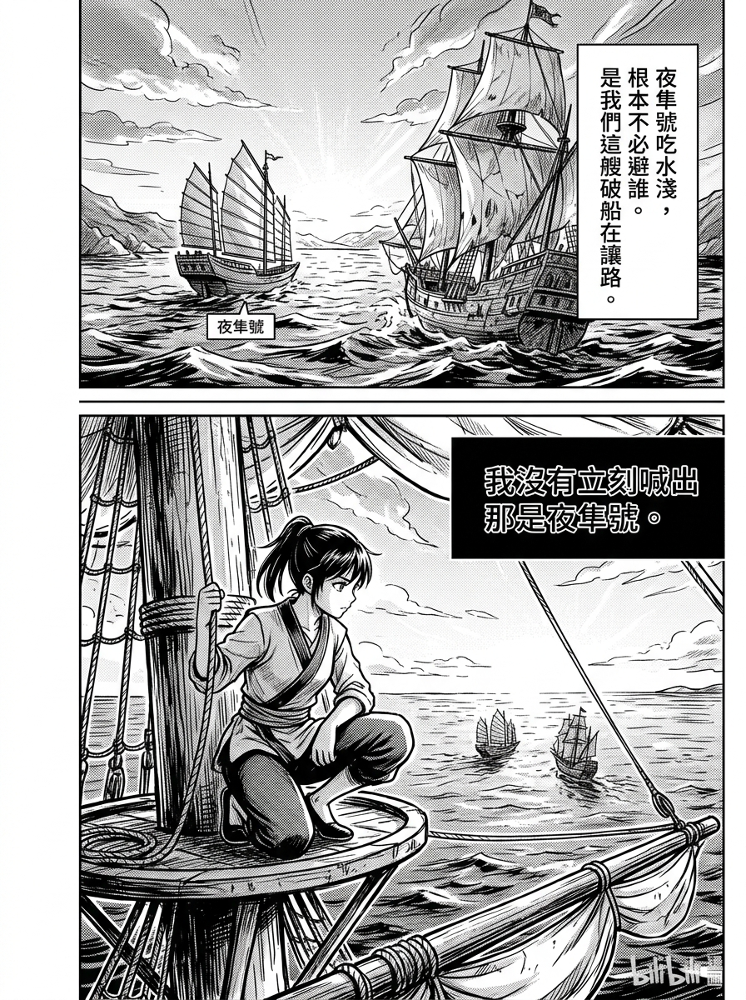
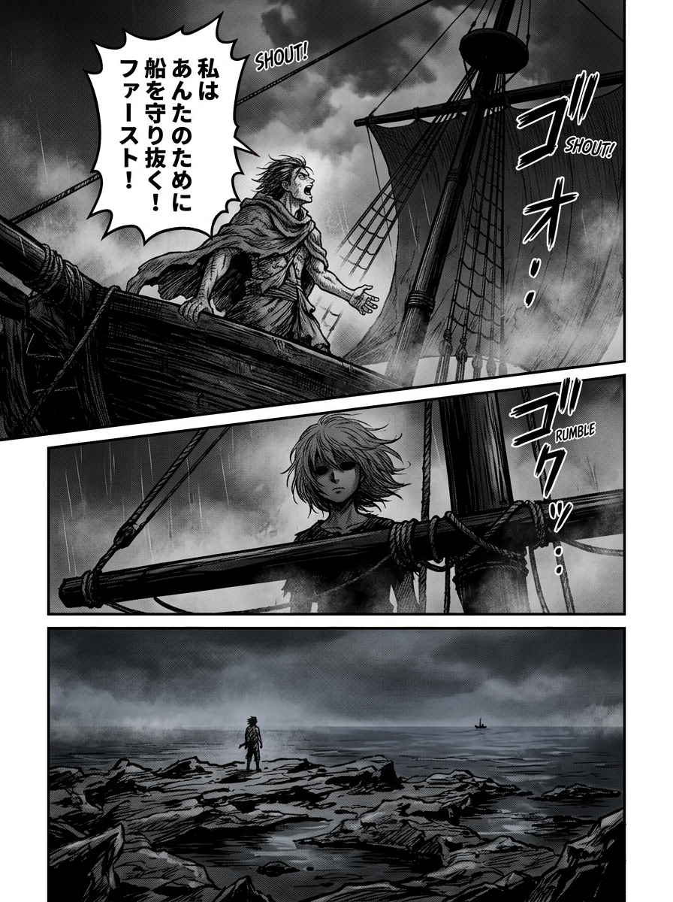
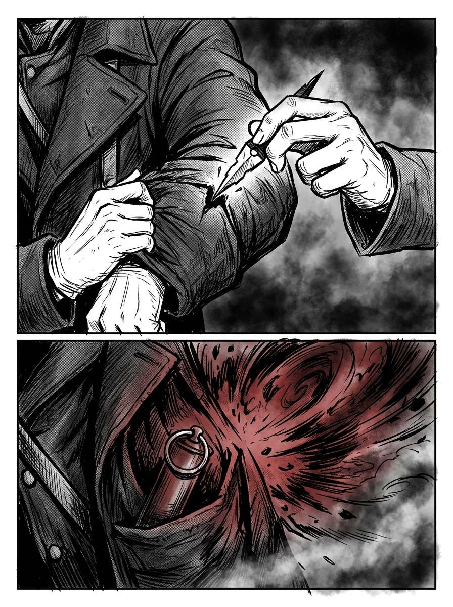
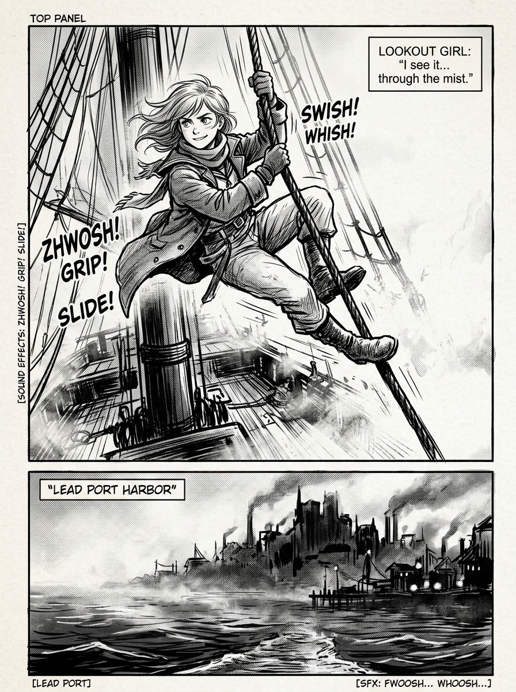

# 第 001 話〈鏽鯨號上的三年〉

## P1 & P2 — 瞭望手真正值錢的地方與讓路

**P1-①**〔承前・中景〕凜蹲在桅頂，看著夜隼號駛遠。
　字幕：「我沒有立刻喊出那是夜隼號。」

**P1-②**〔特寫〕嘴唇。閉著。
　字幕：「第一條規矩：看見的東西，未必要說出來。」
　字幕：「底下那些只會喊『有船！』的學徒以為瞭望手的本事在眼睛 —— 其實在嘴。」

**P2-①**〔遠景〕鏽鯨號慌張轉舵；夜隼號從容通過。
　字幕：「夜隼號吃水淺，根本不必避誰。是我們這艘破船在讓路。」

**P2-②**〔中景〕凜蹲著，**連動都沒動**。桅頂燈一盞盞從霧裡漂遠。

---

## P3 & P4 — 嘩變（回憶）與礁石上的黑點

**P3-①**〔回憶・遠景〕三年前，同樣白的霧。夜隼號甲板。
**P3-②**〔回憶・中景〕卡戎站在甲板正中，**仰著頭**朝桅頂喊。他沒有爬上來。
　卡戎「凜，下來吧。船，我**先**替你保管。」

▸註：「**先**」這個字用加粗處理。它在 005 會原樣再出現一次，讀者要在這裡就記住這個字的形狀。

**P3-③**〔特寫〕桅頂上凜的臉，第一次出現真正的表情 —— 不是憤怒，是**算不出賠率的空白**。

**P4-①**〔回憶・遠景〕退潮的礁石，一個人影，半桶淡水。
　字幕：「他算準了漲潮會淹了那塊礁，連手都不必弄髒。」

**P4-②**〔回憶・特寫〕海平面上一個極小的黑點（採蚌人的小艇）。
　字幕：「他算錯了一件事 —— 他忘了，把我丟在礁石上的人，是個能在純霧裡先看見船的人。」

▸註：②讓讀者**先看到那個黑點**，再看到她的眼睛。順序不能反。

---

## P5 & P6 — 兩件信物：斷針與信號彈

**P5-①**〔大特寫〕袖袋裡摸出半截羅盤指針，斷口冰涼、參差。
**P5-②**〔小格〕
　字幕：「斷了的指針什麼都不指。」
　字幕：「但每次摸到那道斷口，我就記得：有些東西斷了就是斷了，你拼不回去 —— 你只能拿著那半截，去把該算的帳算清。」

**P6-①**〔特寫〕貼身藏著的一發信號彈。
**P6-②**〔想像格・留白與淡影〕暗紅在霧裡炸開的樣子（**不畫實，這是她的想像**）。
　字幕：「全雲礁海域，只有夜隼號的人認得那個顏色。」

**P6-③**〔中景〕
　字幕：「有人勸我，被丟在礁石上那天就該放了它求救。我沒放。」
　字幕：「一發子彈似的東西，要嘛現在隨便用掉，要嘛留到最準的一刻。我選後者。」

▸註：**P6-② 是伏筆的視覺定金。** 007 兌現時要用同一個構圖，但改成實景 + 黎明天色。

---

## P7 & P8 — 三年的耐性，今天到頭了與鉛港預告

**P7-①**〔遠景〕夜隼號的燈沒入霧的最深處。
**P7-②**〔俯角〕甲板重新圍回火盆，骰子聲響起。
**P7-③**〔中景〕凜滑下半截纜，停在橫桁上，回頭看那片白。
　凜（輕聲）「好啊，卡戎 —— 這次換我先看見你。」

**P8-①**〔大格〕鉛港的輪廓在霧裡（下一話的舞台，先給一眼）。
　字幕：「我那時還不知道，要動這盤棋，第一個會撞上的人，不是卡戎 ——」
　字幕：「是一個帶著一捲海圖、滿腦子規矩、連賭都不會賭的年輕製圖師。」
　字幕（小）：「而他身上，藏著連我都沒算到的一筆。」
