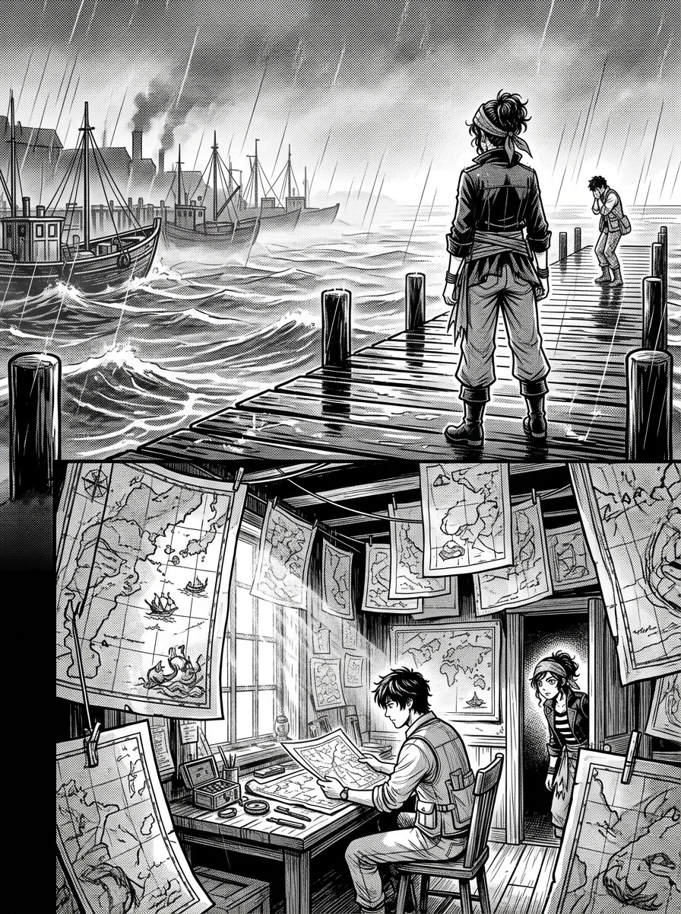

# 第 002 話〈不會賭的人〉

## P1 — 鉛港

**P1-①**〔遠景〕灰、濕、魚腥與煤煙。碼頭木板永遠是潮的。
　字幕：「踩上去像踩在一塊不肯乾的傷口上。」

**P1-②**〔中景〕凜結完工錢，轉身就走；船長塞來半句挽留落在空氣裡。

## P2 — 「圖」

**P2-①**〔中景〕碼頭最裡側的鋪子，招牌只有一個字：**圖**。

**P2-②**〔大格・全頁二分之一〕推門。滿屋子垂掛的海圖，一張壓一張，墨線細如髮絲。
　　　光從紙與紙之間漏下來。
　字幕：「畫這些的人有兩個毛病：太用功，太認真。」
　字幕（小）：「漂亮。也天真得要命。」

▸註：這一格請畫足。圖恩的人格全在這個房間裡，之後不必再解釋他。

## P3 — 兩種信仰

**P3-①**〔中景〕圖恩探頭，墨漬從指尖染到手腕，眼睛亮。
　圖恩「要圖？外礁的有現成，內礁的要等。」
　凜「我要內礁的。現在就要。」

**P3-②**〔中景〕瞭望手牌擱上櫃台。

**P3-③**〔特寫〕圖恩把牌**推回來**。
　圖恩「瞭望手啊。那妳更不該買我的圖。」

**P4-①**〔大格・仰角〕圖恩繞出櫃台，仰頭看滿屋海圖，神情近乎虔誠。
　圖恩「我畫圖，是為了有一天，這片海上最笨的舵手，照著我的圖也能穿過內礁 ——
　　　　不必把全船人的命，押在某個瞭望手今天眼睛靈不靈上。」

**P4-②**〔特寫〕他回頭，笑得坦白。
　圖恩「到那天，瞭望手這行就該收了。妳 —— 就是我想讓你們失業的人。」

**P4-③**〔小格〕凜。**沒生氣，嘴角反而動了一下。**

## P5 — 斷針上桌

**P5-①**〔特寫〕半截斷針擱在畫滿完美礁線的桌上，**斷口朝著圖恩**。
　凜「你畫的這些，是昨天的礁。」

**P5-②**〔中景〕垂著的海圖在穿堂霧風裡輕輕晃。
　凜「霧不是一張能畫完的紙。你量得再準，那都是你『去測的那一天』的海。」
　凜「你的圖會讓舵手放心。而在這片海上 —— 讓人放心的東西，最會害死人。」

**P5-③**〔特寫〕斷針被往前推了半寸。
　凜「我這半截針，就是相信『一具好羅盤不會錯』的人留下來的。」

**P5-④**〔小格〕圖恩「那妳信什麼？」（不是抬槓，是真的想知道）
　凜「信眼睛。信耐性。信賭 —— 但只賭我算得到賠率的局。」

## P6 — 反擊

**P6-①**〔中景〕
　凜「你不賭，圖恩，你以為把一切都量準了就不必賭。
　　　可你連自己手上這份內礁圖會被拿去做什麼，都還沒賭明白。」
**P6-②**〔特寫〕圖恩愣住。
　字幕：「我就等他這句。」

## P7 — 把答案念出來的臉

**P7-①**〔中景〕
　凜「你下個月要去補測內礁，是有人出錢請你去的吧。不是商港的例行委託 —— 是個船長。對不對。」
**P7-②**〔特寫〕圖恩臉上那點慌張。
　字幕：「圖恩的表情，比任何海圖都好讀。」
**P7-③**〔中景〕
　圖恩「他付了訂金，比商港的價高三倍，只要我把『沉鐘礁』補得一寸不差。
　　　　他說……那是為了航運安全。」

**P7-④**〔特寫〕凜的臉。**什麼都沒動。**
　字幕（內心）：「沉鐘礁。」
　字幕（小）：「桅頂的規矩，第一條 —— 看見的東西未必要說出來。」

## P8 — 銅牌

**P8-①**〔中景〕抽屜拉開，取出一塊磨得發亮的小銅牌。

**P8-②**〔特寫〕俯衝的隼。
　字幕：「那是夜隼號舵輪正中央的徽記。」
　字幕（小）：「卡戎奪了我的船，連徽記都剝下來鑄成了對暗號的銅牌。」

**P8-③**〔大特寫・全頁三分之一〕**隼翼羽毛裡，一道極細的暗紋。**
　字幕：「但讓我手指發涼的，不是這個。」

**P8-④**〔插入格・回憶・低對比〕父親那具老羅盤的背面，一模一樣的一道刻痕。
　字幕：「那道暗紋的刻法，我這輩子只見過一個人會用。」

▸註：**③④ 是全書第一個鉤子。** ④ 只給刻痕，**不要給父親的臉或手**，
　　讀者此刻只該知道「有一個更早的人」。

## P9 — 有人借卡戎的局說話

**P9-①**〔中景〕滿屋子的海圖在她眼裡全模糊掉。
　字幕：「卡戎不會這個。卡戎這種人，連模仿都模仿不來這道暗紋。」
　字幕：「這塊銅牌，是有人 —— **不是卡戎** —— 借著卡戎的徽記，
　　　　往這局裡遞了一句只有夜隼號的人才讀得懂的話。」

**P9-②**〔中景〕凜看著圖恩。
　字幕：「而把這句話帶進門、卻完全不知道自己帶了什麼的，就是眼前這個人。」

## P10 — 各懷半句真話

**P10-①**〔中景〕瞭望手牌與斷針，一起按在桌上。
　凜「你那份內礁的圖，我不買了。我跟你一起去測。免費替你看霧 ——
　　　換你一件事：補測沉鐘礁那天，我站你身邊。」
　圖恩「為什麼？」

**P10-②**〔特寫〕凜笑了。
　凜「因為你這種不會賭的人，一個人去那片海，會死。」

**P10-③**〔小格・內心・可用留白處理〕
　字幕：「另外半句，我留在心裡 —— 而且你身上，不知怎麼的，揣著一張我等了三年的牌。」
