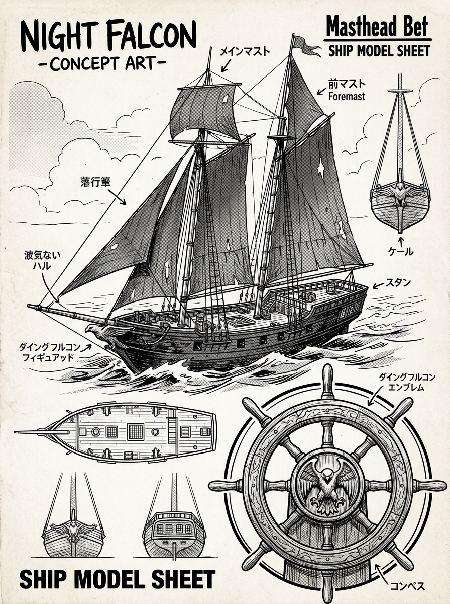

# 夜隼號 — 船設與視覺圖稿 (v1)

> 🎨 **視覺定案 (v1)**：雙桅快船、極淺吃水與舵輪俯衝隼徽記之視覺設定圖 (Visual Concept Sheet)。

## 一、規格（**這幾條錯了劇情會垮**）

| 項目 | 規格 | 為什麼不能改 |
|---|---|---|
| **桅數** | **雙桅快船** | 三桅大艦進不了退潮礁區 —— 全書的核心優勢就是「別人進不去的地方她能進」 |
| **吃水** | **極淺**（比圖恩的測繪小艇只深半尺） | 「能在退潮的礁區裡跳舞」是原文。淺吃水是它的命 |
| **體型** | **小而快**，不是威武大艦 | 它靠靈活不靠火力 |
| **舵輪正中央** | 一隻**俯衝的隼**徽記 | 002 那塊銅牌就是從這裡剝下來鑄的 |
| **007 起** | 徽記處留下**一塊淺淺的疤** | 007-P5③ 有特寫。**被剝過的痕跡要看得見** |

## 二、船名怎麼呈現

**不要在船身寫船名。** 這片海域的船靠**旗**與**徽記**辨識 ——
凜認出夜隼號靠的是**吃水與桅影**，不是讀字。

> 🚫 船身漆上拉丁字母的船名會直接破壞兩件事：
> ① 序章「她從吃水認出自己的船」那個推理過程變成「她識字」
> ② 世界觀 —— 這個海域沒有拉丁字母

## 三、三個階段的樣子

| 話 | 狀態 |
|---|---|
| 000 | **霧中只有桅影**。細節一律不可辨 —— 讀者要跟凜同步，只從輪廓認 |
| 005 | 灰青霧裡壓著礁眼切過來，可見全貌但仍冷 |
| 007 | 黎明。第一次被暖光照到 —— **全書唯一一次它是溫暖的** |
