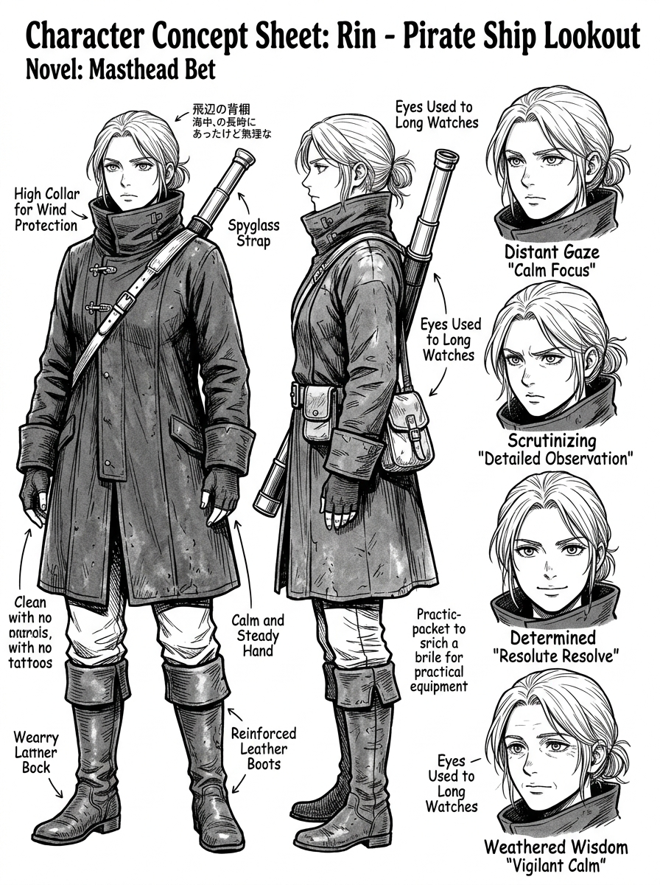

# 凜 — 文字與視覺人設 (v1)

> 🎨 **視覺定案 (v1)**：繪師 gura（Antigravity）繪製之官方角色設定圖 (Visual Model Sheet)。
> 這裡寫的是**畫作細節與作畫判斷依據**。

## 一、她的身體怎麼被使用

**她是瞭望手，不是舵手，不是打手。** 這件事決定她全身的姿態：

- **常態是「蹲」不是「站」** —— 桅頂空間極小，她十幾年都蹲在上面。腿的肌肉是蹲出來的。
- **手是抓的手，不是握兵器的手** —— 常年扣桅杆、抓纜索。**指節粗、掌心繭在虎口與指根**。
- **視線永遠比身體先動。** 她轉頭之前眼睛已經到了。畫她「注意到什麼」時，先動眼睛。
- **她不揮手、不指、不喊。** 需要示意時用最小的動作。全書她唯一一次提高音量是報方位。
- **在甲板上她會不自覺找高處** —— 靠柱子、坐欄杆、站台階。平地讓她不舒服。

> 🚫 **不要畫她掌舵。** 她在整本書裡沒有掌過舵（第四章她說「我看霧、兼掌舵」是說給圖恩聽的
> 　人手分配，畫面上沒有那一場）。**掌舵的形象會把她變成船長，而她要到終章才是。**
>
> ✅ **正確示範：序章 `000_p06`** —— 她在**桅頂瞭望台**，手搭在**弧形欄杆**上，
> 　左右是索具。欄杆與舵輪的差別：欄杆底下接垂直欄柵到平台，舵輪的輻條從輪心放射。
> 　（2026-08-10：summit 曾把這一格誤讀成舵輪並公開指正 gura，是 summit 看錯 ——
> 　更正紀錄留在這裡，免得未來的人照著那句錯話去改一張本來就對的圖。）

## 二、帶著劇情資訊的細節（畫錯會破梗）

| 細節 | 規則 | 為什麼 |
|---|---|---|
| **左手背** | **全書乾淨，沒有霜** | 003-P8② 專門有一格特寫這件事。她守住了父親的話 —— 這是她唯一的道德資產 |
| **袖袋** | 有東西（半截斷針）；她焦慮時會摸它 | 001 / 004 / 007 都有這個動作，是她的定心物 |
| **貼身處** | 藏著一發信號彈 | 007 才拿出來。**在那之前不要畫出形狀** |
| **帽子／帽簷** | 005 起壓低帽簷遮臉（她在偽裝成「霍」） | 007-P3② 她**掀開帽簷**是全書第一次臉被光照到 |
| **望遠鏡** | **可以背，但全書不舉鏡**（gura 2026-08-10 定案；我原本漏寫這條） | 原作第一段是「甲板上那些人**早收了望遠鏡**」而她靠肉眼先看見船。舉鏡的那一格會把「她看得比較早」變成「她裝備比較好」。掛在背上當舊裝備沒問題 —— **它不被使用，本身就是角色說明** |
| **年齡感** | 不是少女。**在海上待了十幾年的成年女性** | 她九歲學讀霜信、替夜隼號找門找了八年、又在鏽鯨號蹲了三年 |

## 三、原作刻意留白（**繪師畫的就是定案**）

- **五官、髮色、髮長、身高** —— 原作一個字都沒寫。**這是給繪師的空間，不是我忘了寫。**
- 唯一的請求：**眼睛要看得出「在看遠處」**。她是全書唯一一個一直在看的人。

## 四、會不會變成 v2

**不會。** 凜的形象全書 v1 到底。

她的變化是**視線的方向**（終章從「看別人的船」變成「看自己要去的地方」），不是外型。
**那個變化要用構圖表達，不是換人設。**

## 五、常見誤畫（開畫前掃一眼）

- ❌ 海盜風頭巾 + 掌舵 + 露齒笑 → 那是海盜片的女船長，不是這本書的瞭望手
- ❌ 少女體型 / 過度可愛化 → 她是靠耐性活了三年的人
- ❌ 手背有霜 → **會直接破壞主題**
- ❌ 序章就露全臉 → 000 話的設計是「先跟她共用眼睛，再認識她這個人」
