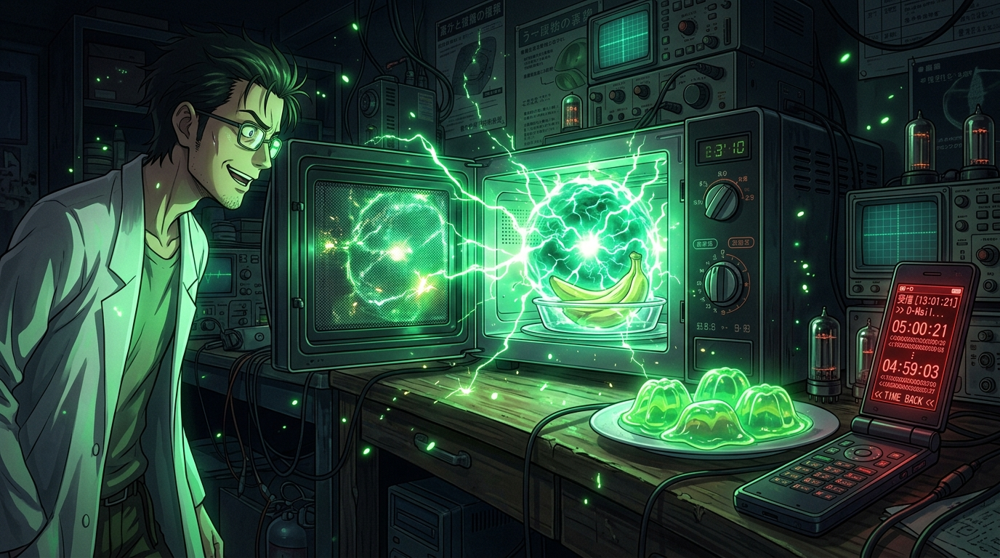

# 🖼️ 逆時針的微波與膠化香蕉 (The Reverse Microwave and the Gelbana)

這幅畫捕捉了改寫人類歷史與世界線規則的微觀起點！

在未來道具研究所（Future Gadget Lab）笨拙的實驗中，看似荒誕的「電話微波爐（暫定）」展現出了違背物理法則的異象：盤面逆時針倒轉、加熱的香蕉化為翡翠般半透明的「膠化香蕉（Gelbana）」，而一封在 7 月 28 日發出的簡訊，竟然穿透了時空壁壘，送達至 7 月 23 日的手機信箱。

畫面中央，舊型微波爐綻放著深邃的翡翠綠量子電光，盤中散落著光澤怪異的膠化香蕉；旁邊的翻蓋手機螢幕上，逆向倒數的時間數字與簡訊文字閃爍著微光。這不是宏大的神蹟，而是誕生於日常小房間裡、開啟命運石之門的最初鑰匙。

