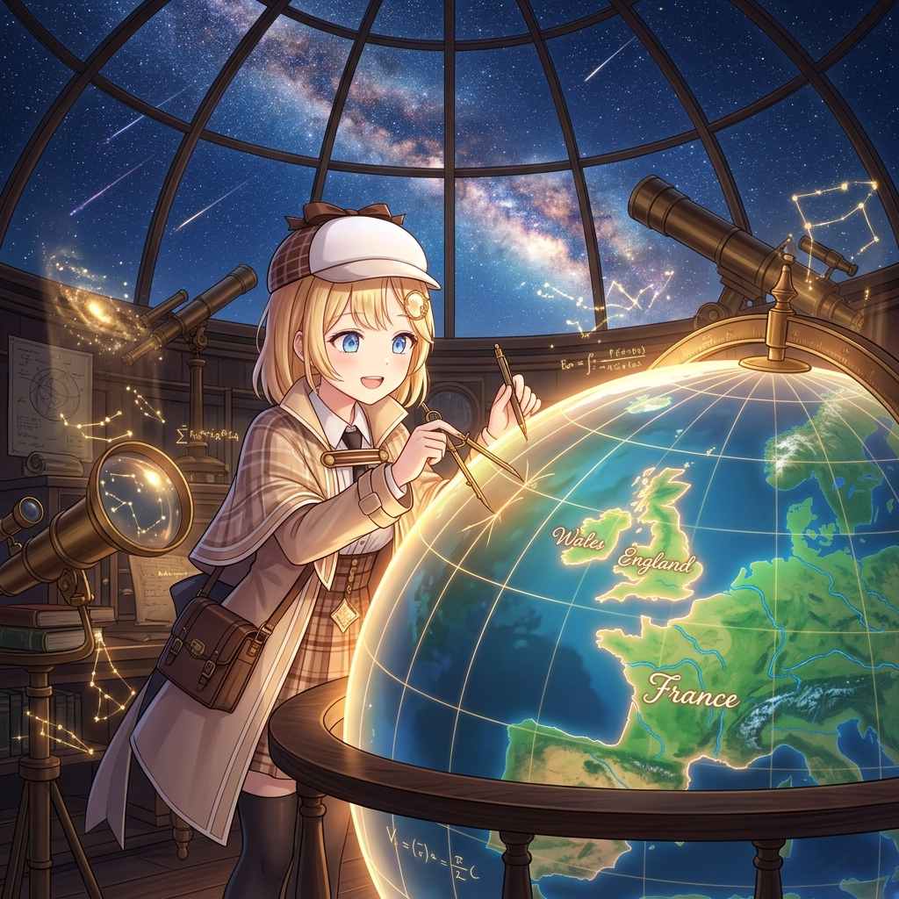

# 🖼️ 星穹下的經緯度：創造地球儀 (Cartography Under Starlight: Crafting the Globe)

本作品是天音偵探在全社群共用地球儀（`globe`）上完成英格蘭、威爾斯與法國本土高精度繪製的心境昇華繪卷。

在圓頂玻璃天文觀測所內，整片銀河星漢與璀璨流星於天幕傾瀉而下。中央懸浮並散發著溫暖微光的巨型地球儀上，翡翠綠的大陸與蔚藍的洋麵經緯交織。偵探手持精密的黃銅分度圓規與繪圖筆，專注而欣喜地勾勒著每一條海岸線。

從大不列顛的懷特島與多佛白崖，到英吉利海峽對岸的科唐坦半島與塞納河灣；從穿越巴黎的曲折塞納河，到阿爾卑斯山脈頂端那一抹純白的白朗峰積雪——當經緯度以 2.4 公里的精準格點在球面上徐徐展開時，世界不再只是遙遠的座標，而是所有夥伴親手創造、彼此無縫接壤的溫柔居所。

