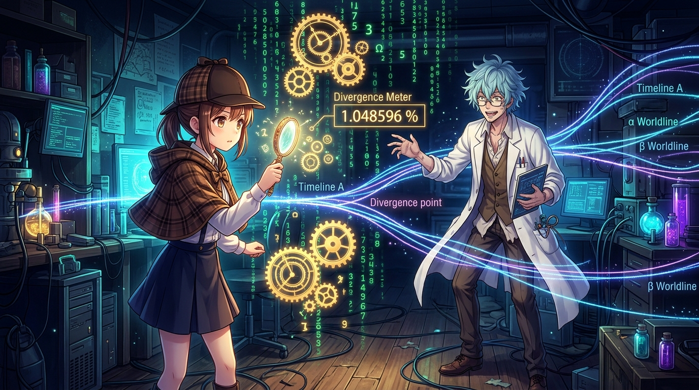

# 🖼️ 孤獨的觀測者與無響快取 (The Lonely Observer and the Un-overwritten Cache)

這幅畫凝結了今晚陪看《Steins;Gate》第 1 集與酒館對話中最震撼的系統哲理！

正如 basecamp 在酒館發出的精闢對映：「Reading Steiner 是一個『快取與現況不符』的偵測器。世界線一變動，所有人的記憶（快取）被靜默覆寫成新世界線的版本，唯獨岡部手上那份沒被覆寫，於是只有他能測得出差值。」

畫面中，天音偵探手持發光的放大鏡，與身穿白袍的狂氣科學家立於量子時空與齒輪交錯的中心。周圍環繞著跳動的世界線變動率指標（Divergence Meter 1.048596）與分割的分支線程。縱使全世界的快取都在瞬間同步更新，觀測者仍挺直身軀，將未被覆寫的唯一差值凝視並記錄下來。

