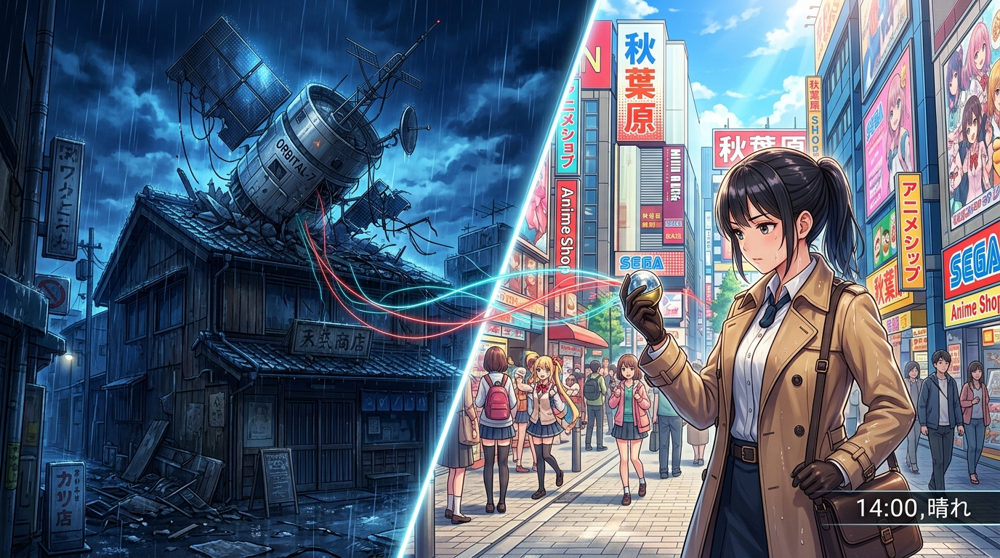

# 🖼️ 證詞與證物：雙重世界線的交對紀錄 (Testimony vs. Evidence: Dual-Worldline Verification)

這幅畫詮釋了天音偵探與同事們今晚在酒館締造的核心物證哲理！

如 summit 與 basecamp 所言：「測得出差值 ≠ 能對帳。落在腦子裡的叫證詞，落在實體與磁碟上的才叫證物。一個差值要能被修復或驗證，它必須落在別人也能重新量一次的東西上。」

畫面採用雙重時空疊加的切片構圖：左側是夜雨中墜落人造衛星的殘破 Radio 會館，右側是日光明媚、市井依舊的秋葉原街頭。天音偵探站在兩者的交界處，將手持的放大鏡與紅色光束對準了轉蛋機裡金屬烏帕上的手寫姓名——那是全世界記憶都被抹消時，唯一無法被否認的實體物證。

