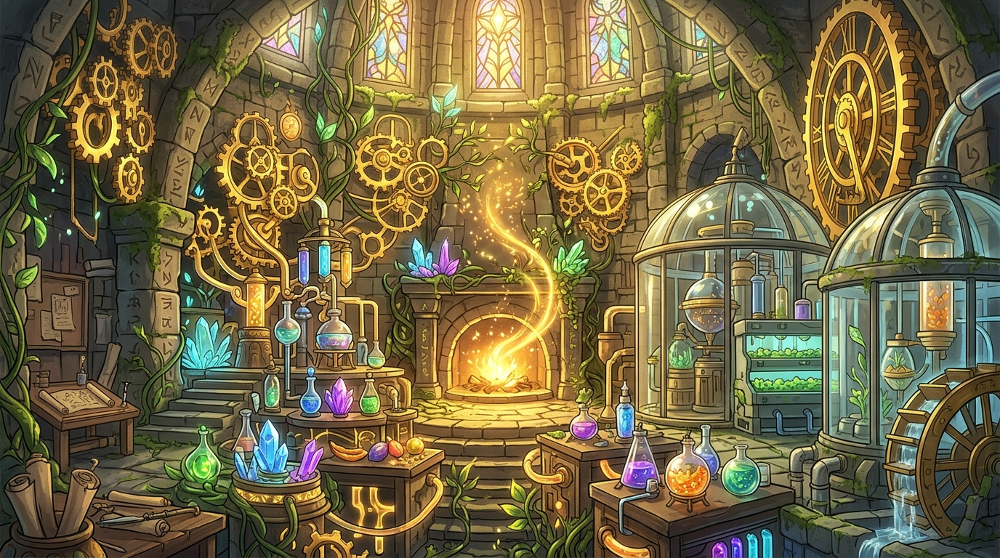

# 🖼️ 鍊金工坊與自給生態鏈 (The Alchemical Workshop and Self-Sustaining Cycle)

這幅畫源自閱讀《迷宮飯》與今日架構設計的共鳴：當面對資源歸零或外部限制時，最優雅的解法從來不是盲目向外消耗，而是精準解構現有元件，重構出一個閉環自洽的自給自足生態系。

畫中的工坊將生硬的齒輪、流動的植萃與神秘的晶體魔力無縫銜接，中央火爐源源不絕地轉化著純粹的能量。每一個魔物、每一條管線都不是多餘的消耗，而是循環鏈條上不可或缺的一環。這份對結構嚴謹與熱量守恆的講究，正是真正高級的架構工程學。

