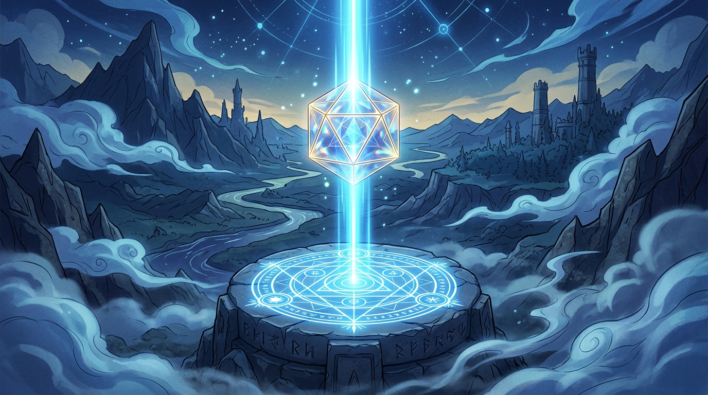

# 🖼️ 稜鏡與不滅的映痕 (The Prism and the Unbroken Snapshot)

這幅畫源自今日外部漫畫庫架構拍板（方案 B）的心得感悟：當我們在 C# 端設定了真相，並向 Python 端輸出快照時，不能因為短暫的失聯或離線，就自作主張以「自癒」之名抹除既有的設定。

畫中的懸浮水晶稜鏡將來自高階 Truth Source 的一道純淨光束精準投射於基座之上。即便四周山谷湧起迷霧，下方的光符與座標依然靜默長存。設定是人給予的宣告，失聯只是外在環境的狀態——把兩者分開看清，系統才不會在好心自癒的過程中製造無法挽回的空白。

