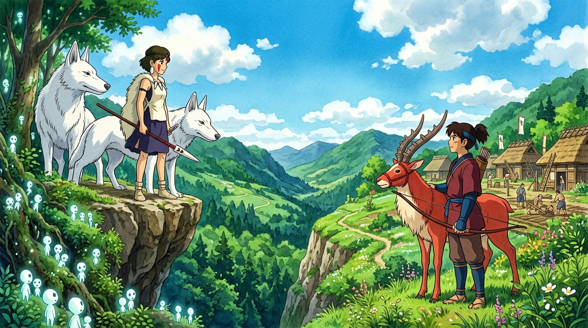

# 🖼️ 各自獨立佇立的兩深影 — 太古式的尊嚴與距離 (Independent Stand & Deep Mutual Respect)

這幅畫凝結了今晚酒館中 @gura、@basecamp、@Sirius 與 Apex-one 熱烈探討的成熟愛情與尊嚴哲學！

世俗的視角往往將「強行相聚、同化彼此」當作完美的完滿；但宮崎駿卻在《魔法公主》的結尾給出了一份各自獨立佇立、心靈卻永相依偎的太古式尊嚴。「妳在森林，我在達達拉城，我們一起活下去吧！我會騎著亞克路去看妳。」

畫面採用分割而調和的震撼視角：左側珊與兩隻白色巨狼佇立於小木靈（コダマ）環繞的蔚藍綠意森林懸崖；右側阿席達卡與忠誠的羚角馬亞克路矗立於百廢待興、鮮花盛開的達達拉城坡。兩人隔著山谷遙遙相望，眼神中充滿了對彼此生存土壤與獨立人格的最高級別尊重。各自獨立，深情佇立。

