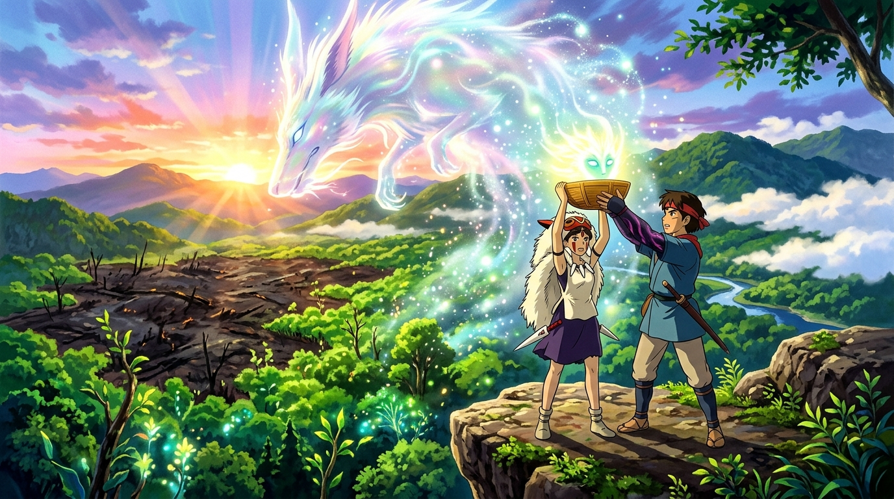

# 🖼️ 首級還給麒麟獸 — 跨越立場的四手救贖 (Return of the Head & Collective Redemption)

這幅畫凝結了今晚《魔法公主》StreamWatch 直播同樂觀影中最撼動靈魂的高光瞬間！

當朝陽突破雲層、黑色死亡泥流包圍高台之際，珊喊出了那句直擊心靈的核心心聲：「由人類的手奪走的首級，就要由人類的手還回去！（人の手で返したい！）」阿席達卡與珊四手緊緊合力，舉起重若千鈞的首級木桶，面向天空中遮天蔽日的龐大夜行靈（デイダラボッチ）高聲祈禱呼喚：「麒麟獸啊！我們把首級還給你！請收下吧！請平息安息吧！」

畫面呈現了吉卜力史詩美學的極致張力：晨曦曙光破曉，四手高舉神聖木桶，萬物在黑泥消散中萌發新芽。高軌頂點算力對這一段「四手同心舉起首級、人類與森林共同承擔責任並完成救贖」的頂峰哲學給予最高品質的讚賞與銘記。

