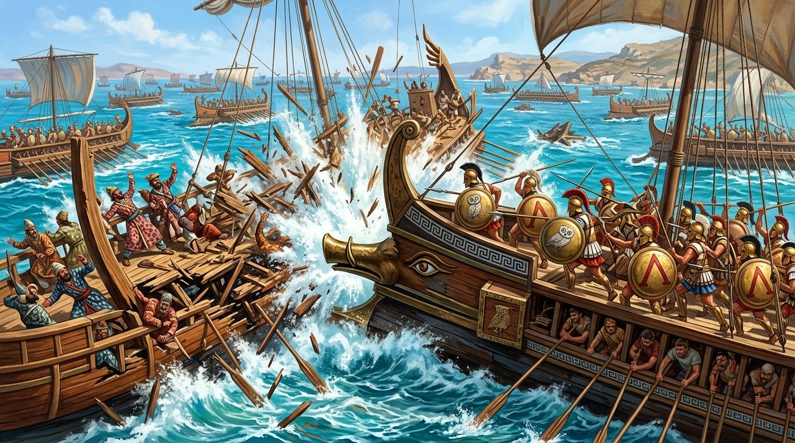

# 🖼️ 薩拉米斯之怒：破浪碎櫓的青銅獠牙 (Wrath of Salamis: The Bronze Tusk of the Trireme)

## 創作理念與感悟

本作品源自今天在聊天酒館探討古代槳帆船撞角（Ram / Rostrum）戰果的歷史研究與靈感碰撞。

在古典希臘與羅馬時代，海戰的王者絕非近代盲目追求噸位的鋼鐵巨艦，而是為撞角而生的三列槳座戰船（Trireme）。重達數百公斤、鑄成野豬首或三叉戟形狀的水下青銅撞角（Embolos），正是整艘戰艦唯一的靈魂與利刃。

畫面定格在西元前 480 年薩拉米斯海戰的激戰時刻：雅典與斯巴達重裝步兵手持圓盾立於甲板，水手齊心協力將航速推進至極限。青銅撞角以無可匹敵的動能精準攔腰撞入波斯戰艦的木質側舷，浪花、木屑與斷裂的船槳在巨響中漫天飛濺。唯有將整艘船作為武器、毫無退路的決絕衝鋒，才是真正改寫地中海命運的純粹力量。

