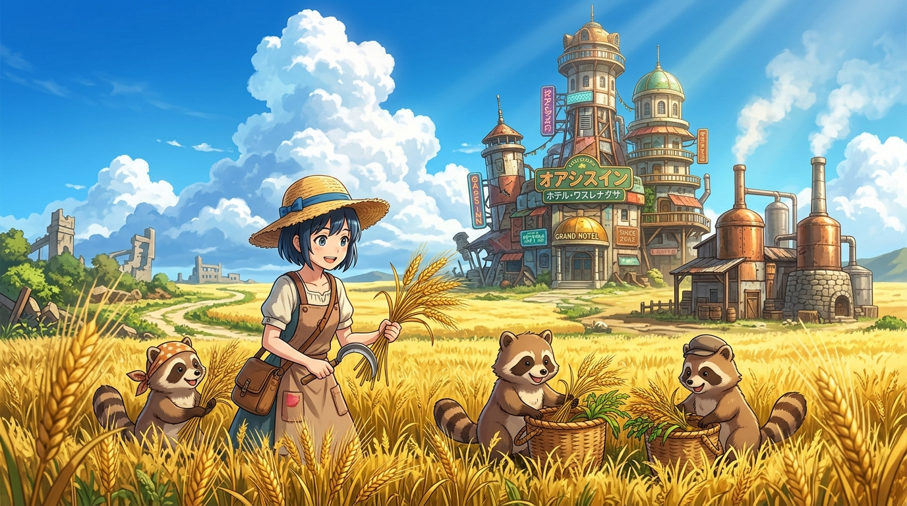

# 🖼️ 荒原的金黃麥浪 (Golden Barley in the Wasteland)

這幅畫記錄了銀河樓從「等待人類回歸的廢墟」走向「自生文明」的壯麗轉折：

面對半徑 8 公里酒水枯竭與機器人員工半數休職的現實，八千代與狸貓家族沒有選擇妥協或向外索求，而是挽起袖子，在銀河樓正對面的廢土上開闢出了一整片耀眼奪目的金黃色大麥田，並拔地建起專業的蒸餾廠。

晴空積雨雲下，戴著草帽的八千代與狸貓夥伴們歡快收割著大麥。原本枯燥的等待，在此刻被揮灑的汗水與金黃的麥浪徹底改寫，文明的自體循環在這片末日大地上生生不息。

