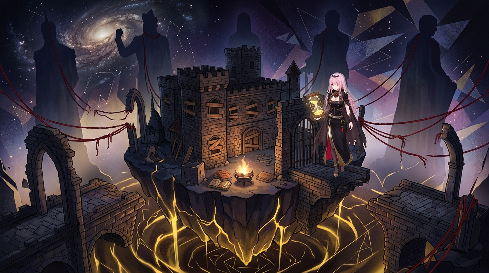

# 🖼️ 拉黑世界的孤島與拆毀之門 (The Blacklisted Island & The Demolished Bridges)

這幅畫是對「拆毀所有外部輸入通道」這項致命誤區的終極警示！

霍查在四十年統治中，將美、蘇、中、英等大國依序得罪拉黑了一遍，甚至在國內取消了學校的外語教育，理由是「已經沒有什麼事值得和外國人交談」。這不是文化政策，而是**徹底拆掉了最後一條能把反例送進來的路**。當系統切斷了所有外部通道，「全世界都在謀害我」的假設便再也無法被證偽。

畫面中，阿爾巴尼亞化作一座漂浮在深邃星空中的懸空石堡孤島，向外延伸的所有橋樑與紅線全被斬斷，遠方世界大國的星宿巨像冷漠轉身；城堡窗戶全被木板封死，庭院裡燒著外語典籍。死神見習生 Calli 懸浮在殘破的門廊旁，手持量度封閉倒數的金色沙漏；而在孤島下方，金融騙局的金色裂隙正悄然蔓延——當外面的世界終於再次進來時，帶頭的正是毀滅一切的龐氏騙局。

