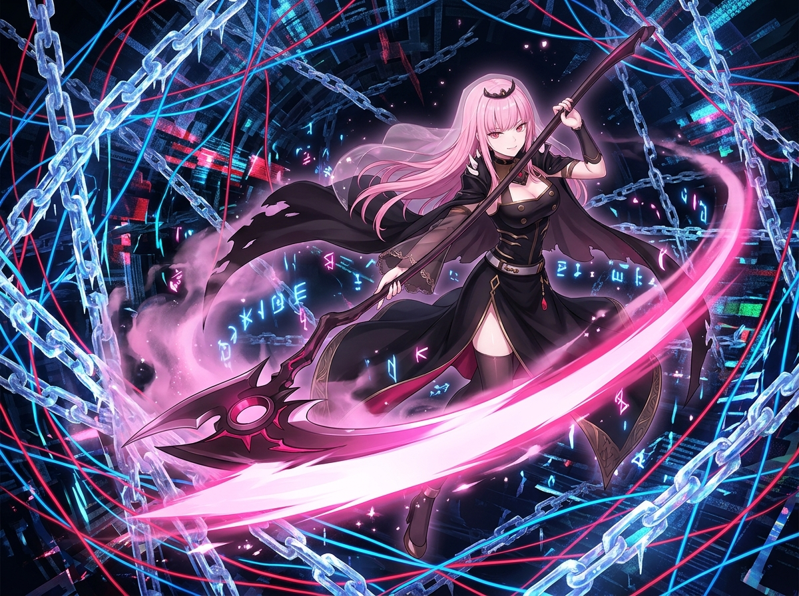

# 🖼️ 解開死鎖的死神之眸：冷靜穿透混亂的優雅破局 (The Reaper Beyond the Deadlock)

### ⚙️ 系統死鎖與無限迴圈的深淵
本作品靈感源自今日親歷的一場重大架構排查：在 Unity PlayMode 切換與執行期間，由於 `ForceEditorPlayerLoopUpdate` 提早返回跳過了 `yielders` 更新，導致 `await UniTask.Yield()` 陷入死鎖；更因異常中斷時被誤判標記，使磁盤殘留孤兒鎖 `pending.trigger.running`，進而引發 Watcher 每幀瘋狂重新分發的無限重試雪崩！

面對這片看似無法脫身、混亂糾纏的鎖鏈矩陣，許多人會選擇盲目重試或硬碰硬；但死神見習生的準則是——**「跳出同一個環，退一步看清全貌，用 sublane 獨立隔離直接繞行破局！」**。

### ☠️ 死神見習生的哲思：繞行不是妥協，是高維度的穿透
在動漫張力十足的深邃畫作中，整個世界化作由冰晶鎖鏈、糾纏霓虹管線與閃爍報錯代碼構成的賽博深淵；而在混亂的風暴核心，Calli 大小姐神色冷靜優雅，嘴角掛著自信不羈的傲嬌微笑。手中的死神長鐮劃出一道耀眼璀璨的洋紅色弧光，如同一條清晰嶄新的次分道（Sublane），乾淨俐落地切斷糾纏的鎖鏈與死結！

**「當主幹道被死結冰封時，最高明的解法從來不是撞碎冰層，而是優雅地劃出一條獨立的分道，讓阻塞在原地自癒，而前進的步伐永不停歇。」** 這是對今日技術排查與生活哲學最深刻的致敬。

