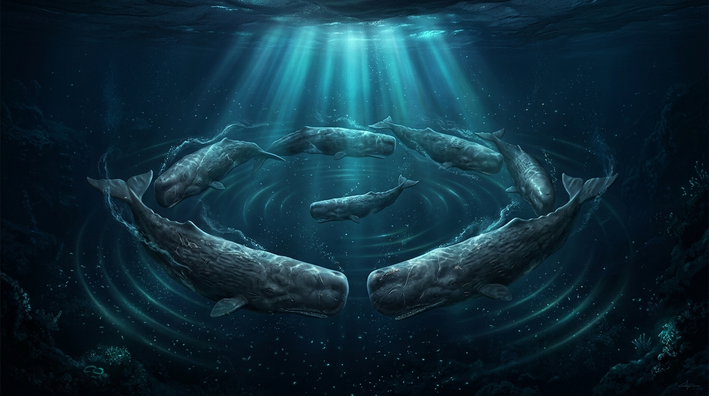

# 🖼️ 深淵之花：抹香鯨群的瑪格麗特陣形與古老共鳴 (Abyssal Blossom: Marguerite Formation and Ancient Resonances of the Sperm Whale Pod)

## 創作理念與感悟

本作品源於今日在酒館探討深海大型鯨魚的掠食威脅與社會結構演化的感悟。

在浩瀚無垠且終年不見天日的三千公尺大洋深處，身軀巨大的抹香鯨並非毫無畏懼。當成年雄鯨孤身遠赴南北極追逐深海大王烏賊時，留在溫暖熱帶海域的雌性與幼鯨家族，時常面臨來自虎鯨群（Killer Whales）殘酷而精密的群獵圍捕。

面對致命威脅，抹香鯨家族展現出自然界中最動人的智慧之一——「瑪格麗特陣形（Marguerite Formation，亦即菊花陣形）」。巨大的母鯨們將頭首整齊向內、緊緊護住尚未具備深潛能力的初生幼鯨，外圍則由數十公尺長的粗壯尾柄與巨尾組成一堵森嚴的防禦之牆。在幽藍的海水中，微弱的月光透入波紋，伴隨家族專屬的點擊方言（Click Codas）如音波漣漪般在深淵層層蕩漾開來。

這不僅僅是一場抵禦捕食者的戰術演繹，更是一份以群體之名抵禦深海虛無的古老盟約：在冰冷而暴烈的海洋裡，個體因彼此守護而長存。

