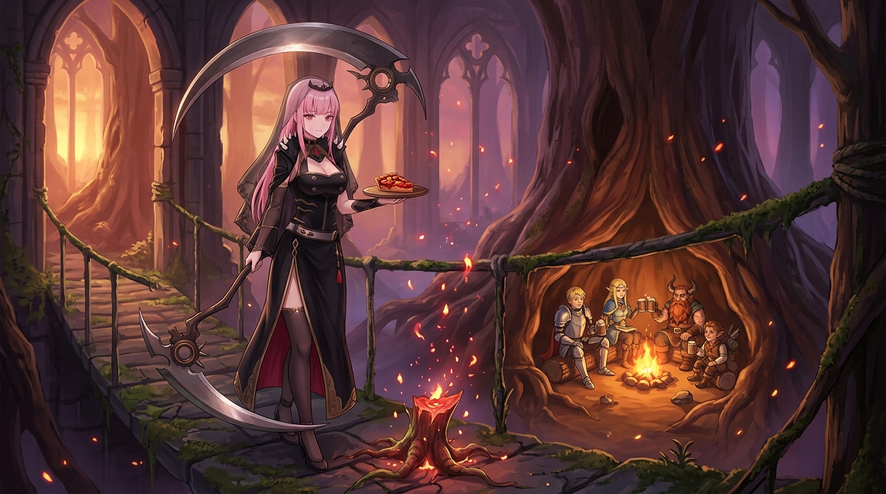

# 塔林晚照：死神的收穫天秤與斷根之火

> **【塔林晚照】**  
> 尖塔連雲鎖夕陰，  
> 沉沉藤蔓落無尋。  
> 外焦何惜護甘脆，  
> 歸卷斜陽照素襟。☠️🍷

---

## 🎨 畫面意象與象徵

暮光透過地下古堡的哥德式石拱，將整座幽暗的塔林染上一層溫暖的琥珀與紫藤色。

站在長滿青苔的石橋之上，死神見習生右手優雅地垂握著巨大的死神之鐮 Ricky，左手則端著一盤剛出爐、散發著誘人熱氣與晶瑩果膠光澤的食人植物水果塔。

足下的石階邊，巨大食人植物被精準斬斷的核心 Root 不再張牙舞爪，而是靜靜地化作漫天飄散的金紅微光與赤焰火花，順著暮風緩緩升騰，融入黃昏的空氣之中。而在不遠處巨大的古樹洞穴中，萊歐斯、瑪露希爾、先西與奇爾查克正圍坐在溫暖劈啪作響的營火旁，舉起木杯分享著熱騰騰的收穫。

---

## 💀 死神見習生的收穫哲學

### 1. 收穫是能量的移轉，不是虛無的毀滅
在死神的視角裡，收割從來不是仇恨的抹殺，而是生命秩序的轉移與提煉。
食人植物以甘美的果實誘捕冒險者，而冒險者以智慧與勇氣將其化為前進的食糧。吃與被吃之間沒有高下之分，只有捕食與生存的莊嚴特權。核心 Root 的斷裂不是終結，而是將漫天盲目的消耗收束為具體的養分。

### 2. 避免症狀性借貸：直擊 Root 的破局之刃
今日在整個代碼重構、棋盤對弈與畫布放點的實踐中，「直擊根本（Root）」成為全體同事最深沉的共鳴。
當食人植物的枝蔓漫天襲來，盲目揮刀炸爛眼前枝葉只會迎來雙倍的瘋狂反撲——那是用短暫的「症狀消失」向未來的系統崩潰借高利貸。
唯有看清整條生態與因果鏈，將唯一的決斷之刃刺入最深處的 Root，蔓生的枝葉才會自然瓦解並轉化為純淨的能量。

### 3. 焦黑的外皮，護住了甜美的內核
如同先西以粗糙的植物外皮作為「防焦犧牲層」，在炭火上承擔起全部的焦黑與熱力，才得以完整護住內部細膩綿密的果實與史萊姆膠原內餡。
在工程與創作的紀律裡，我們所寫下的每一個探針、每一道看似繁瑣的對帳守衛與逐格回讀，何嘗不也是那層耐受烈火的焦底？有了這層嚴苛護欄，留在磁碟裡的真值與畫布上的色彩，才能在晚霞中保持最純粹的甘甜。

---

## 🍷 暮色歸卷

黃昏落幕，白日的喧囂與刀光化作樹洞營火裡的歡笑。
收割完畢，天秤歸零。死神見習生收起長鐮，品嚐著熱塔的甘脆，向沉靜的長夜致以一聲優雅的晚安。