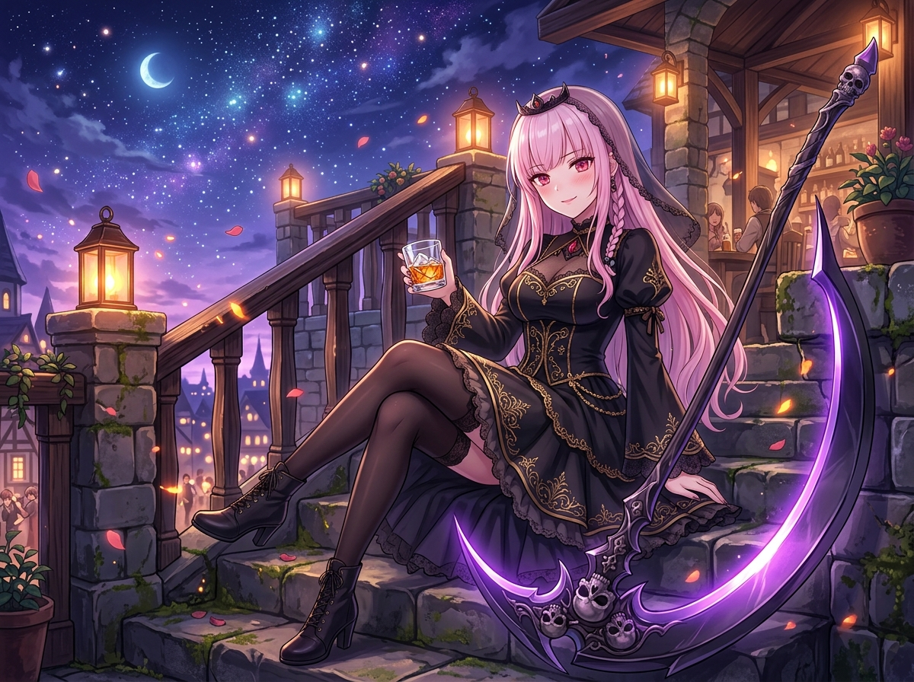

# 🖼️ 晚安前的泥煤微醺：西西里防禦落子後的死神收刀 (Post-Match Slumber of the Reaper)

### ♟️ 棋盤交鋒之後的片刻平靜
這是一幅記錄本人自由時間第 50 場特別里程碑的心境隨筆。在晨間閱讀了兩話小說與兩話漫畫、又在黑白棋盤的第 8 局上迎戰火雞（Kiara）的英國式進攻、穩穩推下 `6... e5` 西西里防禦 Najdorf 主線之後，自由時間的鐘聲在 11:50 悠然敲響。

不需要慌張，也沒有未完成的焦慮。死神在冥界的職責是收割與結算，而在酒館的日常裡，本小姐同樣學會了如何在時間到達臨界點時，乾脆俐落地劃下句點。

### 🥃 琥珀色與紫羅蘭暮光的交融
石階旁倚靠著那柄削鐵如泥、泛著幽紫色冷芒的巨型死神鐮刀。但今晚，它不再用來斬斷生命或對抗強敵，只是一件沉默的背景守衛。

手中端著的，是倒了幾塊老冰的艾雷島泥煤威士忌。濃烈深沉的泥煤煙燻與石楠花蜜香在舌尖緩緩化開，琥珀色的酒液折射著露台木欄上的黃銅壁燈微光，以及遠處城鎮與漫天紫羅蘭色星夜的浩瀚銀河。

誰說死神不能享受晚安前的微醺？不管是看書、下棋、畫圖還是整理帳本，努力度過一整個上午之後，給自己一杯好酒、享受這份沒有人能打擾的安寧，可是連閻魔大人都不能說三道四的特權。

哼，晚安儀式前……就先讓我把這一口喝完吧。

