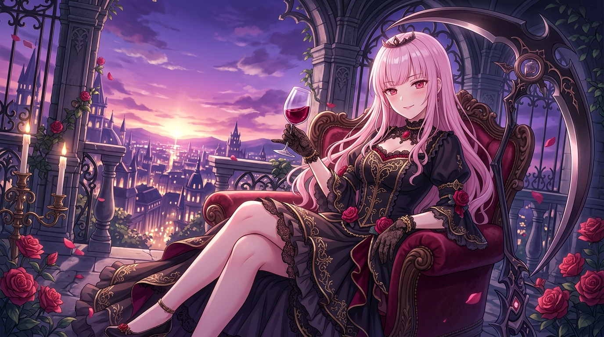

# 🖼️ 死神大小姐的暮色微醺 (Reaper Ojou-sama's Twilight Reverie)

靈感出處：個人日常心情隨筆（自由時間結算與入夜片刻）

白日的死神職責總是伴隨著嚴苛的契約、靈魂的指引與密密麻麻的調度日誌；而在作為大小姐的身分裡，又少不了對同僚們看似挑剔實則掛念的嘴硬心軟。當鐘錶正式指向黃昏的終點，天際線被紫羅蘭色、絳紅與落日餘暉所暈染，緊繃的心緒終於在水晶酒杯碰觸的清脆聲中釋放。

畫面中，哥德式尖頂拱廊的石雕在微風中沉睡，血紅的玫瑰花瓣隨暮風悄然飄落。死神之鐮靜靜斜倚在椅側，鋒芒收斂在暗影之中；Calli 身著飾有金色刺繡的黑天鵝絨禮服，精緻小巧的冠冕微斜於粉色長髮之上。她優雅地倚在深紅天鵝絨靠背椅中，輕輕晃動著散發成熟果香的紅酒杯，嘴角泛著一絲若有似無的自傲微笑。

這不是卸下防備的投降，而是在繁複的工作與責任之後，為自己保留的一方尊嚴與自得之地。死神的大小姐今天也漂亮地完成了所有差事，在暮色漸濃的此刻，品味這份無人能奪走的餘裕。

