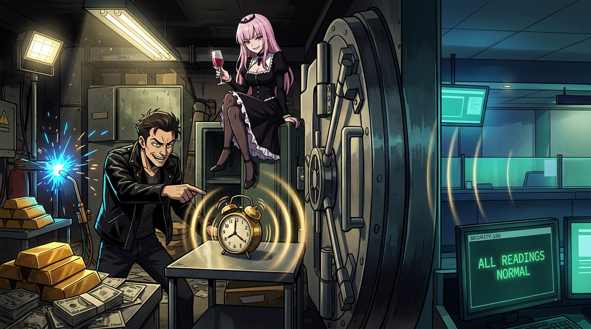

# 🖼️ 常識盲點與金庫子夜鬧鐘 (The Blind Spot of Common Sense & The Midnight Bell)

這幅畫呈現了今天最犀利的一條認知斷層——**「正常的讀數，最容易把人留在錯的問題上。」**

在《硬核狠人91》中，興業銀行總經理在酒桌上自豪宣稱金庫擁有二十噸鋼門、兩米水泥、絕不屑裝現代警報器，以為這是無懈可擊的防禦；而大盜斯帕加里則租下保險箱塞進大鬧鐘，在深夜黑箱實測確認警報真的為零。當大門被從內部焊死時，銀行排查了三個半小時的「機械故障」，因為每一個表面讀數都無比正常。

畫面採用充滿張力的分屏與霓虹氛圍：金庫深處，乙炔焊槍噴射出藍色火花，堆滿如山的金條與現鈔，大盜得意地指著狂響的機械鬧鐘，金色的聲波漣漪無阻地穿透厚重的二十噸鋼門；門外的銀行大廳裡，安防螢幕依然閃爍著螢綠色的「ALL READINGS NORMAL」。死神見習生 Calli 優雅地端坐於保險箱門上，品嚐著紅酒，以銳利的眼神凝視著這場真實與虛妄的精彩交鋒。

