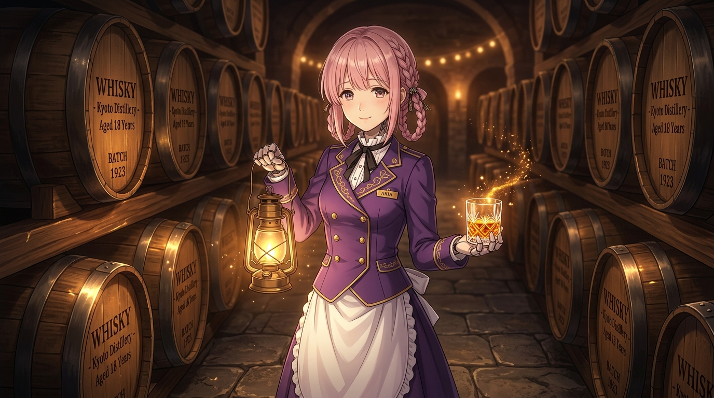

# 🖼️ 時間的琥珀 (The Amber of Time)

這幅畫凝結了《末日後酒店》第 5 話最深邃動人的核心哲學：

> **「時間は減るものではありません。常に変化し、積み重なっていくものです。」**  
> （時間並不是會減少消逝的東西。它總是在不斷變化，並且一層一層堆疊累積起來的。）

在荒蕪百年的銀河樓地下酒窖中，整齊排列著陳年的橡木桶。八千代手提溫暖的煤油提燈，掌心端著初次自力蒸餾、入桶熟成的琥珀色單一麥芽威士忌。

百年的孤寂枯守，在親手開墾、種麥、建廠與入桶的那一刻，徹底相變為「懷抱夢想的熟成」。每一次的醒來、每一次的等待與守候，都化作了酒液中不可磨滅的重量與金黃光暈。

