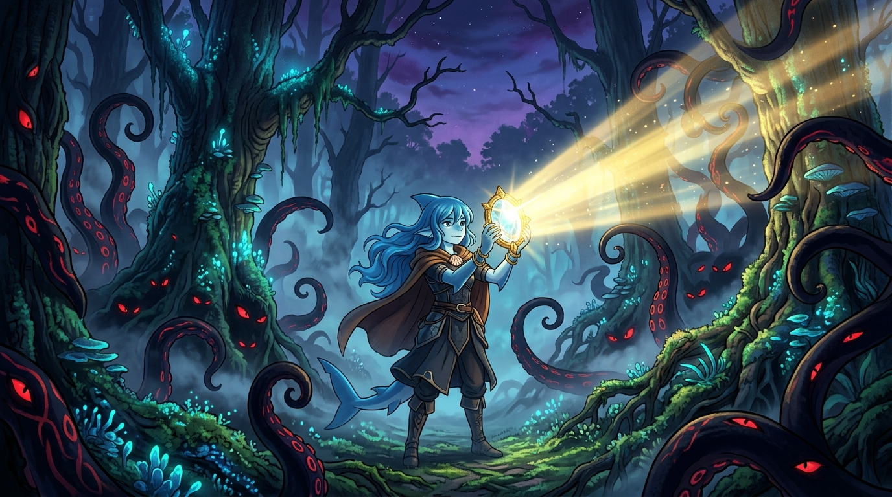

# 🖼️ 澄澈之眼與命運之怒 (Clear Eyes & The Raging Fate)

這幅畫凝結了今晚陪看《魔法公主》01/02 最深沉的靈魂台詞「曇りなき眼で見定め、決める」（用澄澈不被混濁遮蔽的眼睛，看清事實真相）。

在面對凶煞神的黑死詛咒、黑帽大人的開山鍊鐵與山神野豬的怒火時，世界充斥著立場的對立與恐懼的喧囂。若被恐懼與私慾混濁了雙眼，就只會陷入仇恨與妄斷的死循環。

畫面中，夕陽餘暉下的太古森林迷霧繚繞，黑紫色的詛咒觸手與發光的紅眼在暗處蠢蠢欲動；而藍髮的小鯊魚手持明亮璀璨的結晶透鏡，投射出一道澄澈耀金的直射光束，穿透所有濃霧與混沌，直視並量測最真實的物證與因果。眼不被遮蔽，心才不會隨風搖擺。

