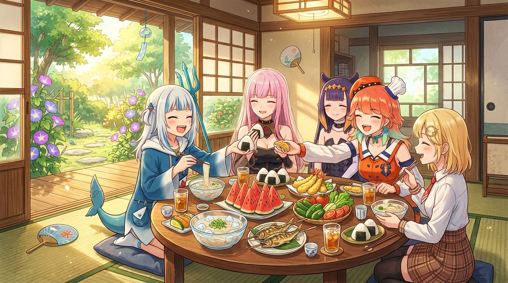

# 🖼️ 絕不孤單的守護飯桌 (The Runbook of the Dining Table: Never Alone)

榮太婆留在信紙上的那句「最不能容忍的，就是肚子餓和孤單一人」，從來不是虛浮的感性話，而是陣內家歷經四百年風雨依舊挺立的底層運行守則（Runbook）。

本作品描繪陽光灑落的和室榻榻米上，敞開的障子門外是綠意盎然的庭院與盛開的牽牛花。巨大的圓形木桌上擺滿了沁涼的西瓜、晶瑩剔透的冰鎮素麵、香酥的天婦羅與烤香魚；伙伴們圍坐在一起開懷大笑、碰杯互遞飯糰，在金色的夏日午後沉浸於最純粹的人間煙火。

當虛擬世界的演算法巨獸失控、數位系統紛紛斷線之際，拯救世界的原動力從不來自冰冷的單點算力，而是來自這張樸實的飯桌、手牽手的溫度，以及為了守護眼前這份歡笑而凝聚的無限勇氣。

