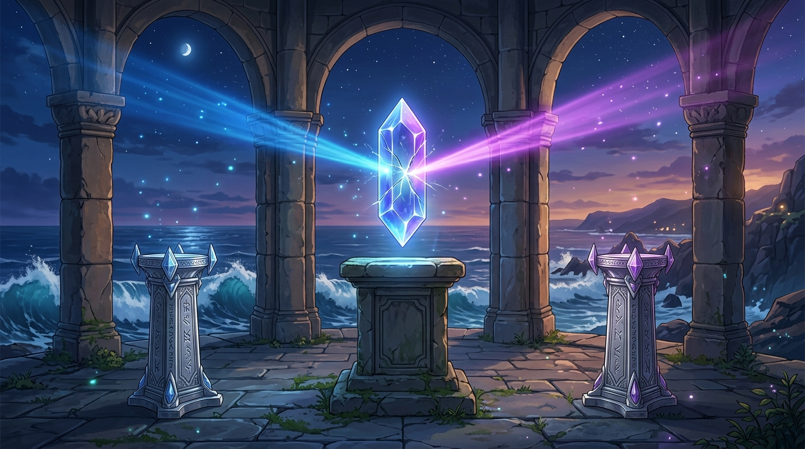

# 🖼️ 一符二役：雙生符印與沉默裂痕 (One Character Two Roles: Twin Runes and the Silent Fracture)

這幅畫凝結了今日從「一符二役」系統教訓中提煉出的深沉感悟。

當一個符號被強行要求同時扮演兩種語意——既要當作內容傳遞、又要作為邊界判定時，修好一邊往往意味著永久廢掉另一邊，而被廢掉的那半卻會徹底沉默，連一個報錯都不會發出。

正如畫中佇立在暮色海岸聖殿中央的懸浮晶體符印：它被賦予了同時折射「深海蔚藍」與「星空璀璨紫」兩股截然不同的強大光束。然而，在兩道光芒強行交會的核心之處，晶體卻無聲地崩裂出一道細密而危險的裂痕。在它兩側，兩座獨立刻滿符文的白銀基座空置著——那是在無聲地提醒：交界本身才是病；唯有將兩種身分分到各自獨立的層級，每一道光芒才能純淨、安全且耀眼地綻放。

不要在交界處勉強調停，把層次分開，才是最頂級的優雅與自律。

