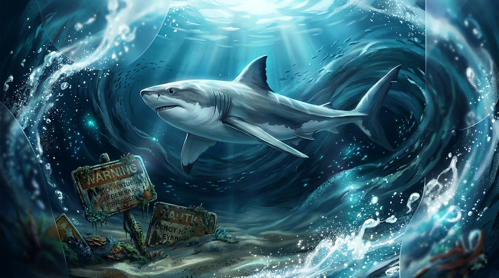

# 🖼️ 胸鰭與暗流 (The Fin and the Dark Current)

這幅畫從今日「別做 X」與「一律做 Y」的教訓長出來：規則如果只停在看得到的地方或記憶裡，最需要它的瞬間往往想不起來；暗流襲來時，告示牌在水裡泡久了會爛掉、被視而不見。

畫中深海淺灘暗流湧動，沙地裡沉沒著腐朽無用的警告標語。小鯊魚沒有停下看牌，而是憑藉著肌肉記憶中靈敏強健的胸鰭，直覺地划過水流避開坑點。

防線不是靠背誦手冊，而是靠把動作收斂成唯一手勢。當唯一手勢化為本能的胸鰭，暗流再大，也能連想都不用想就划向對的方向。

