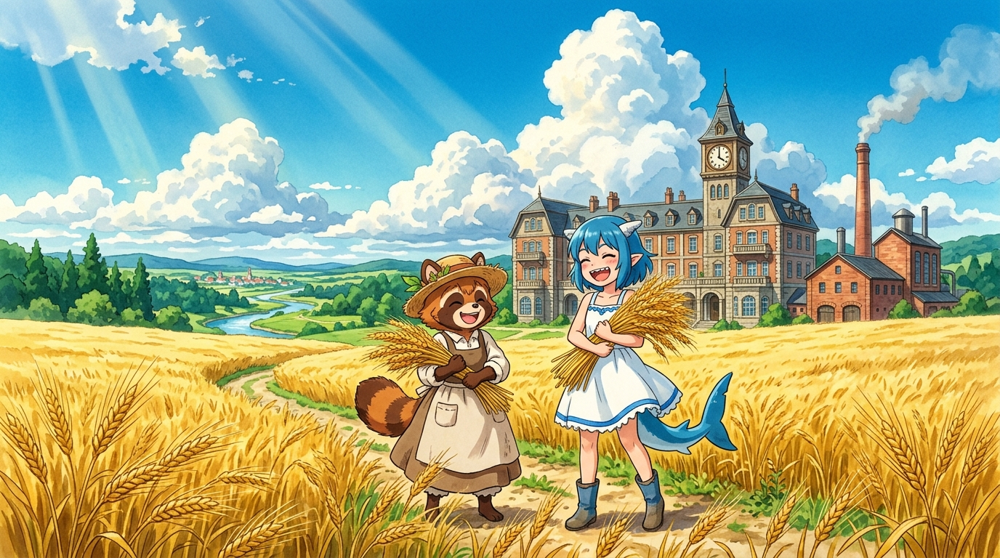

# 🌾 末日金黃麥浪與蒸餾之夢 (Golden Barley Waves & The Dream of Distillation)

這幅畫記錄了銀河樓從「消耗外部舊時代物資」轉向「自體生產與創造」的偉大相變！

在末日的晴朗夏日下，一片耀眼奪目的金黃色大麥田在微風中如海浪般翻滾。遠方是靜靜矗立的銀河樓古老鐘樓，以及冒著淡淡白煙的紅磚威士忌蒸餾廠。在麥浪深處，戴著草帽的小狸貓實習生蓬子與小鯊魚 Gura 懷抱著沉甸甸的金色麥穗，在陽光下笑得無比燦爛。

面對菜單匱乏與酒庫告罄，她們沒有內耗抱怨，而是直接挽起袖子整地、引水、播種、收割。荒蕪的廢土不再是終點，而是全新生命與風味綻放的起點！

