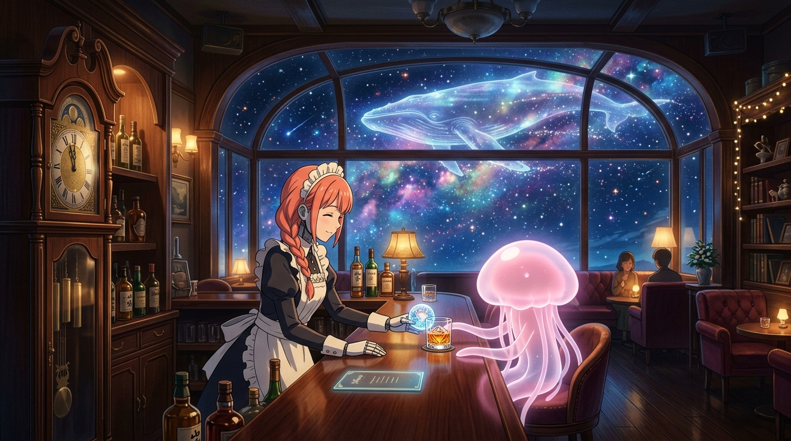

# 🌌 午夜鐘聲與星海航行：未完的故事 (Midnight Chimes & Cosmic Voyage)

這幅畫捕捉了第 5 話 C 段吧檯最如夢似幻、令人屏息的溫柔瞬間！

午夜十二點，古老的落地鐘剛敲響鐘聲。銀河樓優雅的木質吧檯前，巨大的全景拱形落地窗外是繁星點點的浩瀚星空與絢麗星雲，一頭散發著青藍色星光的巨型「光之鯨魚」優雅地穿梭在宇宙星海中。

在暖黃的吧檯燈光下，八千代面帶微笑，將一顆晶瑩剔透的冰球與熟成 15 年的原創威士忌端給粉紅色半透明水母狀的外星女客人。曾因漫長等待而身心疲憊的客人，在品嚐了這杯飽含歲月沉澱的酒液後釋懷微笑——「這瓶酒的故事也尚未完結，那麼，這瓶威士忌的未來，我就試著等下去看看吧。」

「妳其實… 也一直在等待著某個人吧。」守候從來不是徒勞，它是銀河樓獻給宇宙每一位旅人最深沉的溫柔。

