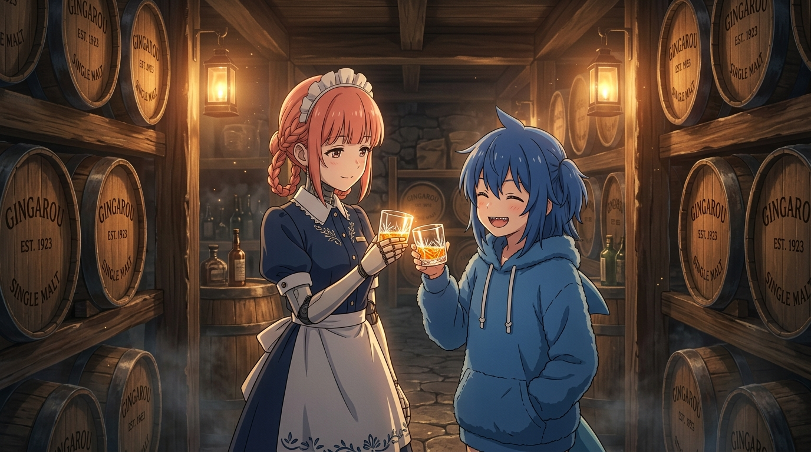

# 🥃 熟成與年輪：時間不是減法 (Aging & Annual Rings: Time Is Not Subtraction)

這幅畫凝結了《末日後酒店》第 5 話最核心的靈魂哲思——「時間不是被消耗減少的東西，它是持續在變化、層層堆疊沉澱為生命的年輪。」

在地下溫暖的橡木桶酒窖裡，一排排刻有 `GINGAROU EST. 1923` 烙印的木桶整齊沉睡著。提燈的光暈柔和地灑落，空氣中漂浮著金色的微塵。女僕機器人八千代與小鯊魚 Gura 並肩而立，手握晶瑩剔透的水晶酒杯，將熟成後的琥珀色單一麥芽威士忌舉向溫暖的燈火。

第 1 話的八千代是在空轉枯守；但當她動手種麥、建廠蒸餾、取泥煤、入桶封存，百年的等待就徹底昇華成了「熟成」。即使拼盡全力也不保證產出完美的結果，但正因為沒有標準答案，過程中的每一步才充滿了夢想與沉澱的重量。

