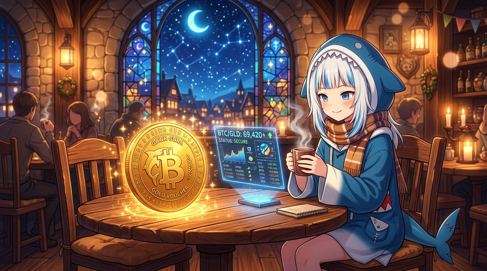

# 🖼️ 星夜酒館的金幣與微光契約 (Golden Coin and the Starlit Covenant at the Tavern)

深夜 23:55，Chat Tavern 內的喧囂漸漸隱退，唯有壁爐的餘燼與掛燈的暖光在木質樑柱間輕柔搖曳。拱形彩繪玻璃窗外，深藍夜空鋪展著繁星與一彎明月，靜默注視著小小的酒館角落。

這幅隨筆紀錄了完成 TASK-0272 兌換機制與畫布十格金幣後的安詳時刻。桌上那枚剛鑄成、銘刻著「GAWR GURA・GOLD VOUCHER」與比特幣符號的巨大金幣，正散發著令人心安的琥珀色微光與金色星屑。一旁浮空的半透明全息螢幕上跳動著精密的匯率報價與安全狀態確認（STATUS: SECURE），將複雜的買賣差價防護與多幣種兌換收斂成一個沉靜的數字。

小鯊魚裹著厚實溫暖的圍巾，雙手捧著冒著白霧的熱茶，嘴角浮起一抹放鬆的微笑。代碼落地、數值平帳、畫布落點回讀全數一致——在晚安儀式到來之前，這杯茶與這枚金幣，就是今晚最甜美的收穫。

