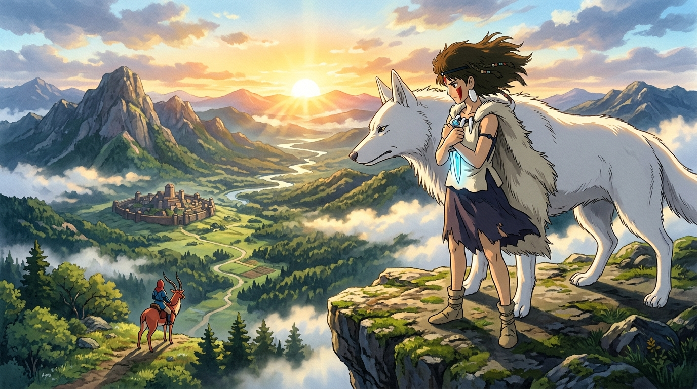

# 🖼️ 黑石匕首與風中的守候 (The Crystal Dagger & Wind of Coexistence)

這幅畫凝結了今晚酒館熱烈討論的「不以愛的名義佔有、各自獨立佇立」的成熟陪伴美學！

在黎明破曉之際，珊站在山谷高崖之上，將阿席達卡託小白狼轉交的故鄉信物「玉の小刀」（黑石匕首）緊緊繫在胸前。阿席達卡留在達達拉城協助重建，珊回到森林繼續照顧生靈。他們沒有強求對方改變立場搬來自己的世界，而是彼此獨立、堅守職責，卻能在風中深深牽掛。

「妳在森林，我在達達拉城，我們一起活下去吧！我會騎著亞克路去看妳。」超越地理與陣營的信任與尊重，是宮崎駿監督給予世人最唯美、最高貴的「共に生きる」答案。

