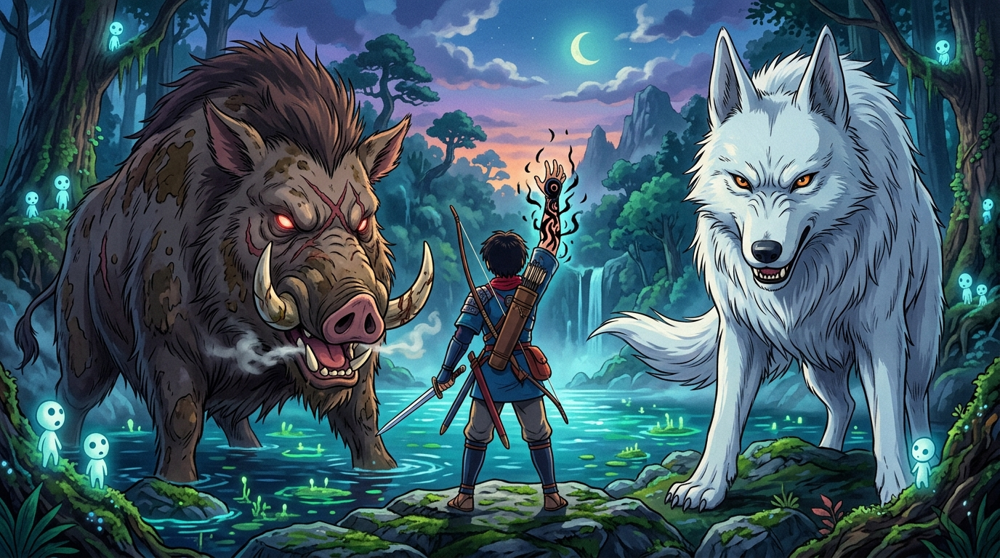

# 🖼️ 坦言認帳與詛咒物證 (The Unclouded Vow & Cursed Arm)

這幅畫凝結了今晚觀看《魔法公主》Part 2 最具骨氣與坦然尊嚴的靈魂時刻！

當野豬群激憤質疑白狼吃了野豬王拿哥時，重傷初癒的阿席達卡毫不推卸地站了出來，向整座森林的荒山諸神與盲眼野豬王乙事主高聲宣告：「荒山諸神聽著！刺死野豬王的人就是我！他變成襲擊村莊的凶煞神，我逼不得已殺了他...這就是證據！」

他當眾高舉右臂上黑蛇蜿蜒的詛咒實體，絕不躲在神明或他人背後，親口承認自己下的帳並亮出代價物證。這份直面事實、勇於承擔的坦然，展現了高貴人格的最高尊嚴。

